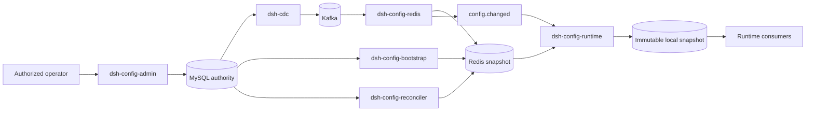

# Agent Note: dsh-config distributed runtime configuration control plane

Status: proposed

English | [中文](2026-08-23-dsh-config-control-plane.zh.md)

## Problem

Deployment tunables are spread across Cordis entry configuration, environment variables, user settings, and package-local constants. Cordis configuration HMR can safely replace a local Loader tree, and the settings service can publish one user's editable namespace, but neither mechanism provides an operator-owned configuration source shared by many Host processes. A server deployment therefore lacks one authoritative place to validate, authorize, audit, distribute, observe, and roll back runtime policy and operational limits.

Reading MySQL for every request would make configuration latency and database availability part of every business operation. Reading Redis for every request would reduce database load but retain a network dependency on the hot path. Writing both MySQL and Redis from the administration request would create partial-success states. CDC alone can propagate committed changes, but it does not create an initial snapshot or repair a projection after Redis loss, expired binlog history, or checkpoint loss.

The system needs a distributed configuration capability whose frequent reads remain process-local, whose changes originate from one durable authority, and whose propagation failures are visible and repairable. It must not turn credentials, business records, protocol constants, schema versions, plugin topology, or security invariants into ordinary editable configuration.

## Proposal

Introduce `dsh-config` as an operator-owned runtime configuration capability. MySQL is the durable authority, CDC publishes committed row changes to Kafka, Redis holds a rebuildable shared snapshot, and each Host keeps an immutable in-process snapshot for high-frequency reads. Administration writes only MySQL; no administration path performs a MySQL/Redis dual write.

The capability does not replace [user settings](../../../../docs/subsystems/settings.md), Cordis composition, Loader HMR, or [credential references](../../../../docs/subsystems/credentials.md). User settings remain user-owned preferences. Cordis configuration continues to select packages, providers, startup-only values, and deployment composition. Credentials and signing material remain in credential or secret providers. `dsh-config` owns platform and tenant operational values that an authorized operator may change while processes are running.

An owning plugin explicitly registers each dynamic namespace, its schema, a schema version, allowed scopes, default values, and one application mode: `live`, `reload`, or `restart`. Registration does not expose the namespace remotely; the administration composition chooses which registered namespaces its authenticated platform API serves. A plugin that combines operator policy with user preference resolves that relationship itself, for example by clamping a user-selected limit to an operator maximum. There is no hidden global precedence between `dsh-config` and `dsh-settings`.

### Configuration classes

`dsh-config` accepts bounded JSON values for deployment or tenant policy, feature admission, quotas, rate limits, timeouts, and other explicitly registered runtime tunables. Protocol constants, database schema versions, identity formats, permission invariants, and fields that change persisted or wire interpretation remain code-owned. Plugin graph, listening addresses, storage roots, database connection bootstrap, and other lifecycle roots remain Cordis or launch configuration and normally use `reload` or `restart` only when an owner can prove safe replacement.

Secret values never enter ordinary configuration rows, Kafka CDC events, Redis snapshots, local diagnostic dumps, or administration responses. A config value may contain a branded credential reference such as `secret://dsh/prod/jwt-signing-key`; the credential owner resolves that reference at use time under its existing access policy.

### Packages

- `dsh-config` defines branded namespace and scope ids, immutable snapshots, registration, reads, watches, revision comparison, schema validation, and application modes.
- `dsh-config-mysql` owns authoritative values, history, optimistic concurrency, transactional administration writes, and scoped reads used by bootstrap and repair.
- `dsh-config-redis` consumes routed CDC records, applies revision-fenced Redis updates, and emits a notification only after the shared snapshot is committed.
- `dsh-config-runtime` subscribes to notifications, loads and validates Redis snapshots, atomically replaces process-local snapshots, polls revisions to recover missed notifications, and retains the last known good value after a rejected candidate.
- `dsh-config-bootstrap` creates a complete Redis projection from a consistent MySQL read before CDC tailing becomes authoritative for that projection.
- `dsh-config-reconciler` compares MySQL and Redis revisions and checksums, repairs drift, and reports projection health.
- `dsh-config-admin` exposes authenticated describe, update, history, rollback, and propagation-status operations without exposing secrets.
- `dsh-config-starter` composes the selected providers and declares CDC routes, Kafka topics, Redis prefixes, health supervision, and deployment policy.

The CDC, Kafka, Redis, MySQL, authentication, and authorization packages remain general infrastructure. Configuration packages consume their public services rather than copying connection, replication, transport, or security logic.

### Authoritative schema

The MySQL provider stores one complete namespace snapshot per scope so a multi-field change commits and propagates as one row instead of exposing mixed configurations between row events.

`dsh_config_values` contains `namespace`, `scope_kind`, `scope_id`, `schema_version`, `revision`, `value_json`, `checksum`, `updated_by`, `created_at`, and `updated_at`. Its primary key is `(namespace, scope_kind, scope_id)`. The first scope kinds are `platform` and `tenant`; per-user preferences remain in `dsh-settings`.

`dsh_config_history` contains the same identity and value fields for every committed revision plus `change_reason`. Its primary key is `(namespace, scope_kind, scope_id, revision)`, and rollback creates a new revision instead of mutating history.

`dsh_config_audit_events` records actor, action, scope, namespace, previous revision, resulting revision, request id, outcome, and bounded metadata. It contains no secret and does not substitute for the security audit design owned by the multi-user control plane; the eventual implementation may project these records into that shared audit service.

Each successful update locks or revision-fences the current row, validates the complete candidate against the live owner schema, inserts history and audit records, increments `revision`, and replaces the current row in one MySQL transaction. A stale `expectedRevision` rejects without persistence. A namespace schema change uses an explicit schema version and migration; a rolling deployment must either accept both active versions or delay activation until every reader supports the new version.

### Redis projection and notification

Redis stores a complete value envelope keyed by deployment, namespace, scope kind, and scope id. The envelope includes `schemaVersion`, `revision`, `value`, and `checksum`. A persistent companion version key or hash remains after a value deletion so a replayed older CDC event cannot recreate stale configuration.

The projection Consumer uses one Lua operation to compare the incoming revision, replace the snapshot, update version metadata, and publish `config.changed`. Equal revisions are idempotent and lower revisions are ignored. The notification carries only namespace, scope, and revision; consumers fetch the snapshot from Redis rather than treating transient Pub/Sub payloads as authority.

Redis Pub/Sub provides low-latency notification but no delivery guarantee. Every runtime polls the relevant Redis revision at a bounded interval and performs an immediate comparison after reconnect. A missed notification therefore delays application until the next poll rather than leaving a process permanently stale. A deployment that requires durable per-instance notifications may replace Pub/Sub with a retained transport without changing snapshot semantics.

### Local runtime snapshots

Startup subscribes before loading Redis, installs a validated snapshot, then rechecks the Redis revision to close the subscribe/load race. Runtime notification handling ignores revisions at or below the installed revision, coalesces bursts for the same namespace and scope, reads the named Redis snapshot, validates schema version, value, and checksum, and atomically replaces one immutable local object. Request handlers read that object without network I/O or locks.

A `live` owner watches committed snapshots and applies them to new operations. One operation captures one snapshot at its entry and does not combine fields from revisions that change while it awaits. A `reload` owner lets the Loader replace its plugin instance through the existing compensating HMR lifecycle. A `restart` owner reports the stored revision as pending and keeps the active process value unchanged until restart. The configuration service never claims that a plugin which captured a constructor value can update itself without reload support.

Invalid or unsupported Redis candidates do not replace the local last known good snapshot. The runtime reports its active revision, observed Redis revision, rejection reason, and last successful application time to health supervision without logging values. Security-critical actions such as principal disablement, credential revocation, and permission removal may require direct authoritative checks or a separate bounded revocation mechanism; eventual configuration propagation is not authorization evidence.

### Bootstrap, reconciliation, and failure behavior

CDC begins at a recorded MySQL binlog coordinate and does not imply a historical snapshot. Bootstrap obtains a consistent MySQL view and matching continuation coordinate, writes version-fenced Redis snapshots, and then allows the CDC projection to continue. A new environment does not serve Redis-backed configuration until bootstrap and continuation are established, unless its composition explicitly permits a MySQL read-through startup path.

Reconciliation periodically compares authoritative and projected revisions and checksums for every active scope. It repairs missing or stale Redis rows through the same revision-fenced projection operation. Redis loss, checkpoint loss, expired binlog position, primary reset, incompatible schema change, poison Kafka record, and reconciliation drift become explicit unhealthy states; the system does not silently declare a partial projection current.

The local runtime may continue with its last known good snapshot during a bounded Redis or Kafka outage. Process startup chooses a deployment policy: fail until an authoritative snapshot is available, or start with code defaults only for namespaces whose owners explicitly allow that fallback. Security namespaces default to fail closed.

### Administration and authorization

Administration accepts an immutable authenticated platform call as proposed by [`dsh-auth`](2026-08-23-dsh-auth-provider-and-consumer-composition.md) and the [multi-user control plane](2026-08-18-multi-user-control-and-data-planes.md). Actions are namespace-scoped, for example `config:read`, `config:write`, `config:rollback`, and `config:secret-ref-use`. A tenant administrator cannot edit a platform scope, and a platform operator does not receive tenant secret values or unrelated business records merely because it can manage operational configuration.

The administration API returns the committed MySQL revision separately from propagation state. A successful write means the authority committed; it does not falsely promise that every runtime has applied the revision. Operators can inspect MySQL revision, Redis revision, and per-runtime active revision and can wait for a deployment-defined convergence target when a rollout requires it.

### Delivery sequence and estimate

P0 defines `dsh-config`, the MySQL schema, immutable local snapshots, revision-fenced administration writes, and periodic MySQL or Redis revision refresh. This stage proves ownership and application semantics before distributed propagation and is expected to require about two engineer-weeks under this repository's package, bilingual documentation, and test requirements.

P1 adds CDC routing, Kafka delivery, the Redis projection, Pub/Sub notification, and local missed-notification recovery. P2 adds bootstrap, reconciliation, authenticated administration, audit integration, rollback, and propagation health. P3 adds rolling-schema compatibility, failure drills, multi-instance convergence tests, operational tooling, and an optional management UI. The complete production design is expected to require roughly eight to twelve engineer-weeks, with a full administration UI adding one to two engineer-weeks; these are planning estimates rather than delivery commitments.

Implementation may stop after P0 when configuration writes are rare and a one-to-five-second revision poll satisfies propagation latency. High read rate alone does not require CDC because request handlers already read local memory. CDC, Kafka, and Redis become necessary when many processes need low-latency convergence, independent replay, or shared projection observability.

## Alternatives considered

**Read Redis on every operation.** Rejected because it puts network latency and Redis availability on the hottest path. Redis is the shared snapshot; the in-process immutable snapshot serves ordinary reads.

**Poll MySQL and omit CDC, Kafka, and Redis permanently.** Retained as the P0 implementation and a viable small-deployment choice, but not the distributed target because every process would poll the authority independently and low-latency propagation would increase database load.

**Write MySQL and Redis in the administration request.** Rejected because the two systems cannot commit atomically. MySQL commits once, and CDC derives every rebuildable projection.

**Make Redis the configuration authority.** Rejected because Redis loss, eviction, and operational rebuild must not erase history or the accepted configuration. Redis remains disposable and reconstructible.

**Use CDC without bootstrap or reconciliation.** Rejected because CDC propagates changes after a coordinate; it neither copies prior rows nor proves that a damaged or emptied projection is complete.

**Send complete configuration through Pub/Sub and apply it directly.** Rejected because Pub/Sub drops messages across disconnects and offers no authoritative read for recovery. Notifications name a revision; Redis stores the corresponding snapshot.

**Apply each key as an independent MySQL row.** Rejected for the first version because related fields could become visible at different revisions. One namespace-scope row gives atomic multi-field activation and a bounded event; exceptionally large namespaces must split into explicitly versioned releases rather than silently losing atomicity.

**Replace Cordis configuration, user settings, and credentials with one universal store.** Rejected because those systems have different owners and security rules. Composition selects runtime structure, user settings store preferences, credential providers protect secrets, and `dsh-config` distributes operator-controlled runtime values.

## Acceptance criteria

- An authorized write validates one complete namespace snapshot, revision-fences concurrent editors, commits current value, history, and audit facts atomically in MySQL, and never writes Redis directly.
- CDC and Kafka can deliver duplicate records without lowering a Redis or local revision, and Redis publishes a change notification only after the corresponding snapshot is committed.
- A Host reads configuration from an immutable local snapshot without network I/O, closes startup and reconnect races, and repairs a missed Pub/Sub notification through revision polling.
- Bootstrap creates a complete Redis projection before tail events become authoritative, while reconciliation detects and repairs missing, stale, or corrupt snapshots.
- Namespace owners declare schema version, scope, default, and `live`, `reload`, or `restart` behavior; invalid candidates retain the last known good runtime value and produce bounded diagnostics.
- Administration separates authority commit from propagation status, enforces platform and tenant actions, records actor and request identity, and never exposes or transports secret values.
- Existing Cordis composition, Loader HMR, `dsh-settings`, credential providers, and business stores retain their current ownership and are not silently routed through `dsh-config`.
- Focused tests cover transaction conflicts, duplicate and out-of-order CDC delivery, subscribe/load races, notification loss, rolling schema rejection, bootstrap continuation, reconciliation repair, Redis loss, and authorization refusal.

## Risks

- MySQL, CDC, Kafka, Redis, Pub/Sub, local snapshots, bootstrap, and reconciliation create several observable revisions and operational failure modes. Health and administration must name each stage without presenting eventual convergence as one atomic distributed commit.
- A raw CDC row protocol couples projection Consumers to the MySQL table schema. A later semantic outbox may offer a more stable event, but adding both at first would duplicate ordering and replay authority.
- One JSON row per namespace simplifies atomic activation but imposes a bounded document size and rewrites the whole namespace. Owners must keep namespaces cohesive and small; large independently changing data belongs in a domain store, not configuration.
- Rolling deployments can disagree about a registered schema. Version admission and last-known-good retention prevent unsafe application, but they can intentionally leave different process versions active until rollout coordination converges.
- Local snapshots make stale reads extremely fast. Revision polling, propagation health, and fail-closed security namespaces are required so performance does not hide prolonged staleness.
- A general administration UI can encourage operators to expose startup structure or secrets as editable values. Registration and exposure remain explicit owner and Host decisions, and review must reject configuration that violates those boundaries.
