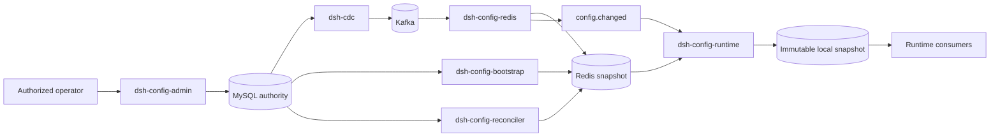

# Agent Note: dsh-config 分布式运行时配置控制平面

Status: proposed

[English](2026-08-23-dsh-config-control-plane.md) | 中文

## 问题

部署调节值散落在 Cordis 配置项、环境变量、用户设置和包内常量中。Cordis 配置 HMR 可以安全替换本地 Loader 树，settings 服务可以发布一个用户可编辑的 namespace，但两种机制都不提供由 operator 拥有、供多个 Host 进程共享的配置来源。因此，服务端部署缺少一个统一位置来校验、授权、审计、分发、观察和回滚运行时策略与运维限制。

每次请求都读取 MySQL，会让配置延迟和数据库可用性进入每项业务操作。每次请求读取 Redis 可以降低数据库负载，但仍会在高频路径中保留网络依赖。管理请求同时写 MySQL 和 Redis 会产生部分成功状态。CDC 可以传播已提交变化，但不能创建初始快照，也不能在 Redis 数据丢失、binlog 历史过期或检查点丢失后修复投影。

系统需要一项分布式配置能力，让高频读取保留在进程内，让变化来自一个持久权威，并让传播故障可见且可修复。它不能把凭据、业务记录、协议常量、schema 版本、插件拓扑或安全不变量变成普通可编辑配置。

## 提案

引入 `dsh-config` 作为 operator 拥有的运行时配置能力。MySQL 是持久权威，CDC 把已提交行变化发布到 Kafka，Redis 保存可重建的共享快照，每个 Host 保存不可变的进程内快照以供高频读取。管理操作只写 MySQL；任何管理路径都不同时写 MySQL 和 Redis。

该能力不替代[用户设置](../../../../docs/subsystems/settings.zh.md)、Cordis 组合、Loader HMR 或[凭据引用](../../../../docs/subsystems/credentials.zh.md)。用户设置继续保存用户拥有的偏好。Cordis 配置继续选择包、提供方、仅启动时使用的值和部署组合。凭据与签名材料继续留在凭据或 secret 提供方中。`dsh-config` 拥有已授权 operator 可以在进程运行期间修改的平台和租户运维值。

所属插件显式注册每个动态 namespace、schema、schema 版本、允许 scope、默认值，以及一种生效模式：`live`、`reload` 或 `restart`。注册不会把 namespace 暴露到远端；管理组合决定其已认证平台 API 对外提供哪些已注册 namespace。插件如果组合 operator 策略与用户偏好，就由该插件自行解析两者关系，例如用 operator 上限约束用户选择的限制。`dsh-config` 与 `dsh-settings` 之间不存在隐藏的全局优先级。

### 配置分类

`dsh-config` 接受有界 JSON 值，用于部署或租户策略、功能准入、配额、速率限制、超时，以及其他显式注册的运行时调节值。协议常量、数据库 schema 版本、identity 格式、权限不变量和会改变持久化或 wire 解释方式的字段仍由代码拥有。插件图、监听地址、存储根目录、数据库连接 bootstrap 和其他生命周期根仍属于 Cordis 或启动配置；只有 owner 能证明安全替换时，它们才使用 `reload` 或 `restart`。

Secret 值永远不能进入普通配置行、Kafka CDC 事件、Redis 快照、本地诊断转储或管理响应。配置值可以包含带品牌类型的凭据引用，例如 `secret://dsh/prod/jwt-signing-key`；凭据 owner 在使用时根据其已有访问策略解析该引用。

### 包

- `dsh-config` 定义带品牌类型的 namespace 和 scope id、不可变快照、注册、读取、观察、revision 比较、schema 校验和生效模式。
- `dsh-config-mysql` 拥有权威值、历史、乐观并发、事务管理写入，以及 bootstrap 和修复使用的 scope 读取。
- `dsh-config-redis` 消费路由后的 CDC 记录，执行带 revision 防护的 Redis 更新，并且只在共享快照提交后发出通知。
- `dsh-config-runtime` 订阅通知、加载并校验 Redis 快照、原子替换进程内快照、轮询 revision 以恢复丢失通知，并在候选值被拒绝后保留最后一个已知有效值。
- `dsh-config-bootstrap` 在 CDC 尾部开始成为该投影权威前，从一致的 MySQL 读取创建完整 Redis 投影。
- `dsh-config-reconciler` 比较 MySQL 与 Redis 的 revision 和 checksum，修复偏差，并报告投影健康状态。
- `dsh-config-admin` 提供已认证的描述、更新、历史、回滚和传播状态操作，并且不暴露 secret。
- `dsh-config-starter` 组合选定提供方，并声明 CDC 路由、Kafka topic、Redis 前缀、健康监督和部署策略。

CDC、Kafka、Redis、MySQL、认证和授权包继续作为通用基础设施。配置包消费它们的公开服务，不复制连接、复制流、传输或安全逻辑。

### 权威 schema

MySQL 提供方按照 scope 为每个 namespace 保存一份完整快照，因此多字段变化作为一行提交和传播，不会在多条行事件之间暴露混合配置。

`dsh_config_values` 包含 `namespace`、`scope_kind`、`scope_id`、`schema_version`、`revision`、`value_json`、`checksum`、`updated_by`、`created_at` 和 `updated_at`。主键为 `(namespace, scope_kind, scope_id)`。第一批 scope 类型为 `platform` 和 `tenant`；每用户偏好继续保存在 `dsh-settings` 中。

`dsh_config_history` 为每个已提交 revision 保存相同 identity 与值字段，并增加 `change_reason`。主键为 `(namespace, scope_kind, scope_id, revision)`，回滚通过创建新 revision 完成，而不是修改历史。

`dsh_config_audit_events` 记录 actor、action、scope、namespace、前一 revision、结果 revision、request id、outcome 和有界 metadata。它不包含 secret，也不替代多用户控制平面拥有的安全审计设计；最终实现可以把这些记录投影到该共享审计服务。

每次成功更新都会锁定当前行或对其执行 revision 防护，根据在线 owner schema 校验完整候选值，在一个 MySQL 事务内插入历史和审计记录、递增 `revision` 并替换当前行。陈旧 `expectedRevision` 会在持久化前被拒绝。namespace schema 变化使用显式 schema 版本和迁移；滚动部署必须让所有活跃版本同时接受两个版本，或者推迟激活，直到每个读取方都支持新版本。

### Redis 投影与通知

Redis 按照部署、namespace、scope 类型和 scope id 保存完整值信封。信封包含 `schemaVersion`、`revision`、`value` 和 `checksum`。持久的配套版本 key 或 hash 在值删除后继续保留，因此重放的旧 CDC 事件不能重新创建陈旧配置。

投影消费方使用一次 Lua 操作比较传入 revision、替换快照、更新版本 metadata 并发布 `config.changed`。相同 revision 是幂等操作，更低 revision 会被忽略。通知只携带 namespace、scope 和 revision；消费方从 Redis 获取快照，而不把临时 Pub/Sub payload 当作权威。

Redis Pub/Sub 提供低延迟通知，但不保证交付。每个运行时以有界间隔轮询相关 Redis revision，并在重连后立即比较。丢失通知只会把生效推迟到下一次轮询，不会让进程永久停留在陈旧配置。如果部署需要持久的逐实例通知，可以替换 Pub/Sub 为保留事件的传输，而不改变快照语义。

### 本地运行时快照

启动过程先订阅，再加载 Redis，安装通过校验的快照，然后重新检查 Redis revision，以关闭订阅与加载之间的竞态。运行时通知处理会忽略不高于已安装 revision 的通知、合并同一 namespace 和 scope 的变化突发、读取指定 Redis 快照、校验 schema 版本、值与 checksum，并原子替换一个不可变本地对象。请求 handler 读取该对象时不执行网络 I/O，也不加锁。

`live` owner 观察已提交快照，并把它们应用于新操作。每项操作在入口捕获一次快照，不会组合其 await 期间变化的多个 revision 字段。`reload` owner 让 Loader 通过已有补偿式 HMR 生命周期替换插件实例。`restart` owner 把已存 revision 报告为待生效，并在重启前保持活跃进程值不变。配置服务不会声称一个在构造时捕获值的插件可以在没有 reload 支持时自行更新。

无效或不受支持的 Redis 候选值不会替换本地最后一个已知有效快照。运行时向健康监督报告活跃 revision、观察到的 Redis revision、拒绝原因和最后成功生效时间，但不记录值。Principal 停用、凭据撤销和权限移除等安全关键操作可能需要直接权威检查或独立的有界撤销机制；最终一致的配置传播不是授权证据。

### Bootstrap、对账与失败行为

CDC 从记录的 MySQL binlog 坐标开始，并不隐含历史快照。Bootstrap 获得一致的 MySQL 视图及匹配的继续坐标，写入带版本防护的 Redis 快照，然后允许 CDC 投影继续。新环境在 bootstrap 和继续关系建立前不提供 Redis 配置，除非其组合显式允许 MySQL read-through 启动路径。

对账按照每个活跃 scope 定期比较权威与投影 revision 和 checksum。它通过同一带 revision 防护的投影操作修复缺失或陈旧 Redis 行。Redis 数据丢失、检查点丢失、binlog 位置过期、主库 reset、不兼容 schema 变化、Kafka 有害记录和对账偏差都会成为显式不健康状态；系统不会静默宣称部分投影是当前状态。

在有界 Redis 或 Kafka 故障期间，本地运行时可以继续使用最后一个已知有效快照。进程启动时选择部署策略：在权威快照可用前拒绝启动，或者只为 owner 显式允许回退的 namespace 使用代码默认值启动。安全 namespace 默认快速失败。

### 管理与授权

管理操作接收 [`dsh-auth`](2026-08-23-dsh-auth-provider-and-consumer-composition.zh.md)与[多用户控制平面](2026-08-18-multi-user-control-and-data-planes.zh.md)提议的不可变已认证平台调用。Action 按 namespace 限定，例如 `config:read`、`config:write`、`config:rollback` 和 `config:secret-ref-use`。租户管理员不能编辑 platform scope，平台 operator 也不会仅仅因为能管理运维配置就收到租户 secret 值或无关业务记录。

管理 API 分开返回已提交 MySQL revision 与传播状态。写入成功表示权威已提交；它不会虚假承诺每个运行时都已应用该 revision。Operator 可以检查 MySQL revision、Redis revision 和每个运行时的活跃 revision，并且可以在 rollout 需要时等待部署定义的收敛目标。

### 交付顺序与估算

P0 定义 `dsh-config`、MySQL schema、不可变本地快照、带 revision 防护的管理写入，以及定期 MySQL 或 Redis revision 刷新。该阶段先证明所有权和生效语义，再增加分布式传播；按照本仓库的包、双语文档和测试要求，预计需要约两个工程师周。

P1 增加 CDC 路由、Kafka 交付、Redis 投影、Pub/Sub 通知和本地丢失通知恢复。P2 增加 bootstrap、对账、已认证管理、审计集成、回滚和传播健康。P3 增加滚动 schema 兼容性、故障演练、多实例收敛测试、运维工具和可选管理 UI。完整生产设计预计需要约八到十二个工程师周，完整管理 UI 另需一到两个工程师周；这些是规划估算，不是交付承诺。

如果配置写入很少，并且一到五秒 revision 轮询满足传播延迟，实现可以停在 P0。高读取频率本身不要求 CDC，因为请求 handler 已经读取本地内存。只有多个进程需要低延迟收敛、独立重放或共享投影可观察性时，才需要 CDC、Kafka 和 Redis。

## 备选方案

**每项操作都读取 Redis。** 否决，因为它会把网络延迟和 Redis 可用性放入最高频路径。Redis 是共享快照；进程内不可变快照服务普通读取。

**轮询 MySQL，并永久省略 CDC、Kafka 和 Redis。** 保留为 P0 实现和小型部署的可行选择，但不作为分布式目标，因为每个进程都会独立轮询权威，低延迟传播也会增加数据库负载。

**在管理请求中写 MySQL 和 Redis。** 否决，因为两个系统无法原子提交。MySQL 只提交一次，CDC 派生每个可重建投影。

**让 Redis 成为配置权威。** 否决，因为 Redis 数据丢失、淘汰和运维重建不能清除历史或已接受配置。Redis 保持可丢弃且可重建。

**使用 CDC，但没有 bootstrap 或对账。** 否决，因为 CDC 传播一个坐标之后的变化；它不会复制更早的行，也不能证明受损或清空的投影完整。

**通过 Pub/Sub 发送完整配置并直接应用。** 否决，因为 Pub/Sub 在断连时丢失消息，并且不提供恢复所需的权威读取。通知命名一个 revision；Redis 保存对应快照。

**把每个配置键作为独立 MySQL 行应用。** 第一版否决，因为相关字段可能在不同 revision 可见。每个 namespace-scope 使用一行，可以实现多字段原子激活和有界事件；特别大的 namespace 必须拆成显式版本化 release，不能静默失去原子性。

**使用一个通用存储替换 Cordis 配置、用户设置和凭据。** 否决，因为这些系统具有不同 owner 和安全规则。组合选择运行时结构，用户设置保存偏好，凭据提供方保护 secret，`dsh-config` 分发 operator 控制的运行时值。

## 验收标准

- 已授权写入校验一份完整 namespace 快照、对并发编辑者执行 revision 防护、在 MySQL 中原子提交当前值、历史和审计事实，并且永远不直接写 Redis。
- CDC 和 Kafka 可以交付重复记录而不会降低 Redis 或本地 revision，Redis 只在对应快照提交后发布变化通知。
- Host 从不可变本地快照读取配置，不执行网络 I/O，能够关闭启动和重连竞态，并通过 revision 轮询修复丢失的 Pub/Sub 通知。
- Bootstrap 在尾部事件成为权威前创建完整 Redis 投影，对账能够发现并修复缺失、陈旧或损坏快照。
- Namespace owner 声明 schema 版本、scope、默认值和 `live`、`reload` 或 `restart` 行为；无效候选值保留最后一个已知有效运行时值，并产生有界诊断。
- 管理操作区分权威提交与传播状态、强制执行 platform 和 tenant action、记录 actor 与 request identity，并且永远不暴露或传输 secret 值。
- 现有 Cordis 组合、Loader HMR、`dsh-settings`、凭据提供方和业务存储保留当前所有权，不会被静默路由到 `dsh-config`。
- 聚焦测试覆盖事务冲突、重复和乱序 CDC 交付、订阅/加载竞态、通知丢失、滚动 schema 拒绝、bootstrap 继续、对账修复、Redis 数据丢失和授权拒绝。

## 风险

- MySQL、CDC、Kafka、Redis、Pub/Sub、本地快照、bootstrap 和对账会产生多个可观察 revision 与运维失败模式。健康状态和管理操作必须命名每个阶段，不能把最终收敛描述成一次原子分布式提交。
- 原始 CDC 行协议会让投影消费方依赖 MySQL 表 schema。后续 semantic outbox 可以提供更稳定事件，但第一版同时增加两者会产生重复排序与回放权威。
- 每个 namespace 使用一行 JSON 可以简化原子激活，但会限制文档大小并重写整个 namespace。Owner 必须保持 namespace 内聚且小；大型独立变化数据属于领域存储，不属于配置。
- 滚动部署可能对已注册 schema 有不同理解。版本准入和最后一个已知有效值可以阻止不安全应用，但它们可能故意让不同进程版本保持活跃，直到 rollout 协调完成收敛。
- 本地快照会让陈旧读取也非常快。revision 轮询、传播健康和快速失败的安全 namespace 必不可少，避免性能掩盖长期陈旧。
- 通用管理 UI 可能鼓励 operator 把启动结构或 secret 暴露成可编辑值。注册与暴露继续由 owner 和 Host 显式决定，review 必须拒绝违反这些边界的配置。
