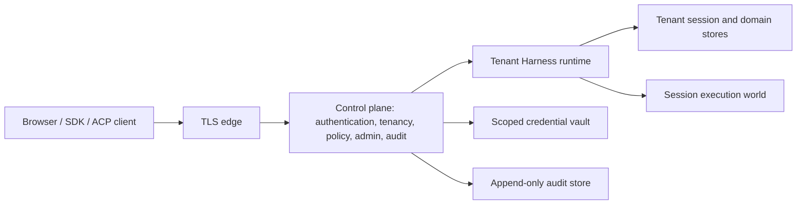

# Multi-user architecture proposal

English | [中文](README.zh.md)

This directory is a design reference for proposed multi-user work. It does not describe shipped behavior. The current Web profile remains a local, single-user application whose browser trust fence is not authentication.

## Position

The secure first implementation should use a control plane, tenant-scoped Harness runtimes, and isolated session execution worlds. Authentication, membership, administration, quotas, and audit belong to the control plane. Session state, settings, credentials, workspaces, and live registries belong to a tenant runtime. Model-controlled filesystem, subprocess, terminal, LSP, code, and workflow execution belong to a container-class session execution world.

A shared Cordis process with `tenantId` added to selected methods is not an acceptable first security boundary. The current service graph contains global listings, live maps, broadcast streams, local paths, same-UID subprocesses, and caches whose keys are only `SessionId`; one missed filter would expose another user's content or authority. Process or container separation limits that failure while tenant-aware APIs are introduced.

Sessions should be private to their owning principal in the first release. A human user or service account owns each session; tenant membership alone grants no session access. Tenant members may share workspace definitions and policy, but reading, steering, approving, exporting, or forking another principal's session requires an explicit later sharing design. Multi-user deployment and collaborative sessions are separate features.

## Current single-user assumptions

| Area | Current evidence | Multi-user consequence |
|---|---|---|
| Browser API | `trustedHosts` prevents DNS rebinding and explicitly provides no authentication | Every HTTP call and WebSocket upgrade needs an authenticated principal before dispatch |
| Session identity | `SessionHeader` has no tenant or owner, and `SessionStore.get/list/fork` accepts only `SessionId` | A known id can select a live or persisted session unless every owner adds an authorization lookup |
| Event delivery | `events.mux` is an all-session stream and opens from `ctx.sessions.list()` | Filtering must happen while subscriptions and baselines are built, not after frames are produced |
| Persistence | SQLite keys sessions by `id`; JSONL scans one configured root and groups by host `cwd` | Every read, list, append, fork, export, and repair needs an immutable tenant partition |
| Workspace data | Workspace order, archive state, paths, and session accounts are registry-global | Workspace records and their global singleton state must be tenant-owned |
| Settings and credentials | One Harness-home settings document and one layered credential provider serve the process | Deployment, tenant, and user layers need separate storage and authorization |
| File and process access | Local filesystem reads are unrestricted; local commands and workflow workers run with the Host OS user's authority | Same-UID local providers cannot isolate mutually untrusted users |
| Telemetry | Uploading modes may export complete event data and use one anonymous Harness-home id | Multi-user deployments need explicit consent, redaction, retention, and tenant-aware attribution |

These are structural assumptions rather than isolated missing checks. The owning packages are documented in [architecture.md](../architecture.md), [the session subsystem](../subsystems/session.md), [the credential subsystem](../subsystems/credentials.md), and [the API trust decision](../../.agents/notes/implemented/architecture/2026-07-28-api-browser-trust-boundary.md).

## Target architecture

The edge terminates TLS and supplies only transport facts. The control plane validates identity-provider or API-token credentials, selects an active membership, authorizes the requested action, records security audit facts, and routes the call. It passes a signed or same-process authenticated call context to one tenant runtime; user-supplied request fields never establish the tenant.

The tenant runtime retains the current plugin model but receives tenant-scoped providers and storage roots at composition. A runtime may initially be one process or container per tenant. A later pool may host several runtime instances only if their in-memory registries, event subscriptions, caches, temporary artifacts, and provider clients remain physically or mechanically partitioned.

The session execution world provides the stronger boundary for model-controlled code. Local filesystem, subprocess, PTY, LSP, code-runtime worker, and workflow-worker implementations remain suitable for trusted local profiles, not for a shared service. A server profile uses remote/container providers behind the existing capability seams and never mounts Host credentials or arbitrary Host paths into that world.

## Security invariants

- Authentication produces an internal stable principal; email, display name, external subject, and request-supplied user ids are not resource keys.
- The active tenant comes from a validated membership. Ordinary product calls cannot choose another tenant by adding a payload field.
- Resource services authorize before existence or content is disclosed. Cross-tenant references return the same external not-found result as absent references unless an administrator is using an explicit control-plane operation.
- Every durable record, live handle, cache entry, event subscription, temporary artifact, and background task has one tenant owner. Session-owned records additionally carry one session owner.
- Session events remain the replay source for model-visible behavior. Authentication tokens and general security-audit records never enter that log.
- A security decision is deny-by-default and cannot be bypassed by calling a lower-level Remote service, resuming a cold session, reconnecting a stream, or using an in-process carrier.
- Local single-user profiles use an explicit local principal and personal tenant. Server profiles have no anonymous or loopback authentication bypass.

## Document map

- [Identity and access](identity-and-access.md) defines principals, authentication, authorization, administrative roles, session ownership, and transport requirements.
- [Data and runtime isolation](data-and-runtime-isolation.md) defines tenant-aware persistence, event and audit logs, settings, credentials, assets, streams, caches, and execution isolation.
- [Session change projections](session-change-projections.md) defines the content-free Kafka event and the Redis/Elasticsearch Consumer obligations for a physically single-tenant, multi-user deployment.
- [Stream chunk retention](stream-chunk-retention.md) defines bounded storage and cleanup for streamed response chunks.
- [Delivery plan](delivery-plan.md) orders the work, defines compatibility posture and negative test coverage, and names decisions that must be settled before implementation.
- The proposed `dsh-mysql` infrastructure service is shared by identity, session persistence, settings, audit, and other relational domains.
- The [multi-user control and data planes Agent Note](../../.agents/notes/proposed/architecture/2026-08-18-multi-user-control-and-data-planes.md) owns the architectural trade-off and alternatives.

## Non-goals for the first release

- Collaborative editing or simultaneous turns in one session.
- Cross-tenant session fork, attachment reuse, search, or shared credentials.
- A custom password database or identity provider.
- A promise that JSONL, local SQLite, local subprocess, or worker-thread execution is production multi-tenant infrastructure.
- Platform-operator access to tenant message content or credential values by default.
