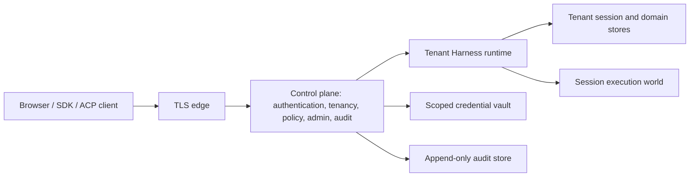

# 多用户架构提案

[English](README.md) | 中文

本目录是多用户工作的设计参考，不描述已经交付的行为。当前 Web profile 仍是本地单用户应用，其浏览器信任防护不是认证机制。

## 立场

安全的首个实现应采用控制平面、租户级 Harness 运行时和隔离的 session 执行环境。认证、成员关系、管理、配额和审计属于控制平面。session 状态、settings、credentials、workspace 和实时注册表属于租户运行时。由模型控制的文件系统、子进程、终端、LSP、代码和 workflow 执行属于容器级 session 执行环境。

在共享 Cordis 进程中只给部分方法增加 `tenantId`，不能作为首个安全边界。当前服务图包含全局列表、实时 Map、广播事件流、本地路径、同 UID 子进程，以及只用 `SessionId` 作为键的缓存；任何一个遗漏的过滤条件都可能暴露其他用户的内容或权限。在引入租户感知 API 的过程中，进程或容器隔离可以限制此类失败的影响范围。

首个版本中的 session 应默认仅归创建它的 principal 私有。每个 session 由一个人类用户或 service account 所有；只有租户成员关系并不会授予 session 访问权。租户成员可以共享 workspace 定义和策略，但读取、steering、批准、导出或 fork 其他 principal 的 session，需要后续单独设计显式共享机制。多用户部署和 session 协作是两个不同功能。

## 当前的单用户假设

| 区域 | 当前证据 | 多用户影响 |
|---|---|---|
| 浏览器 API | `trustedHosts` 防止 DNS rebinding，并明确不提供认证 | 每个 HTTP 调用和 WebSocket 升级都必须在分发前获得已认证 principal |
| Session identity | `SessionHeader` 没有租户或所有者，`SessionStore.get/list/fork` 只接受 `SessionId` | 如果各资源所有者没有补充授权查询，已知 id 就能选中实时或持久化 session |
| 事件交付 | `events.mux` 是全 session 事件流，并从 `ctx.sessions.list()` 建立初始状态 | 必须在构造订阅与基线时过滤，而不是等 frame 生成后再过滤 |
| 持久化 | SQLite 以 `id` 为 session 键；JSONL 扫描一个配置根目录并按 Host `cwd` 分组 | 每次读取、列举、追加、fork、导出和修复都需要不可变的租户分区 |
| Workspace 数据 | Workspace 顺序、归档状态、路径和 session 账目都属于全局注册表 | Workspace 记录及其全局单例状态必须归租户所有 |
| Settings 与 credentials | 一个 Harness-home settings 文档和一个分层 credential 提供方服务整个进程 | 部署、租户和用户层需要独立存储与授权 |
| 文件和进程访问 | 本地文件系统读取不受限制；本地命令和 workflow worker 使用 Host OS 用户权限运行 | 同 UID 本地提供方无法隔离互不信任的用户 |
| Telemetry | 上传模式可以导出完整事件数据，并使用一个 Harness-home 匿名 id | 多用户部署需要显式同意、脱敏、保留策略和租户级归属信息 |

这些是结构性假设，不是几个孤立的检查缺失。相关归属包见 [architecture.md](../architecture.md)、[session 子系统](../subsystems/session.md)、[credential 子系统](../subsystems/credentials.md)和 [API 信任决策](../../.agents/notes/implemented/architecture/2026-07-28-api-browser-trust-boundary.md)。

## 目标架构

边缘层终止 TLS，并且只提供传输层事实。控制平面校验身份提供方凭据或 API token，选择当前有效的成员关系，对请求动作授权，记录安全审计事实，并路由调用。它向一个租户运行时传递签名保护的调用上下文，或者同进程内已认证的调用上下文；用户提交的请求字段永远不能建立租户身份。

租户运行时保留当前插件模型，但在组合时接收租户级提供方和存储根目录。首个实现可以让每个租户对应一个进程或容器。只有在内存注册表、事件订阅、缓存、临时产物和提供方客户端都保持物理或机械分区时，后续的运行池才可以托管多个运行时实例。

Session 执行环境为模型控制的代码提供更强的安全边界。本地文件系统、子进程、PTY、LSP、code-runtime worker 和 workflow-worker 实现仍适用于受信任的本地 profile，不适用于共享服务。服务端 profile 使用现有能力 seam 背后的远程或容器提供方，并且永远不把 Host credentials 或任意 Host 路径挂载到该执行环境。

## 安全不变量

- 认证产生内部稳定 principal；邮箱、显示名称、外部 subject 和请求提交的用户 id 都不是资源键。
- 当前租户来自已校验的成员关系。普通产品调用不能通过添加 payload 字段选择另一个租户。
- 资源服务必须先授权，再披露资源是否存在或其内容。除非管理员正在使用显式控制平面操作，否则跨租户引用和不存在的引用对外返回相同的 not-found 结果。
- 每条持久记录、实时句柄、缓存项、事件订阅、临时产物和后台任务都有唯一租户所有者。Session 归属的记录还必须有唯一 session 所有者。
- Session 事件仍是模型可见行为的回放真源。认证 token 和通用安全审计记录永远不进入该日志。
- 安全决策默认拒绝，并且不能通过调用较低层 Remote 服务、恢复冷 session、重新连接事件流或使用进程内传输绕过。
- 本地单用户 profile 使用显式 local principal 和个人租户。服务端 profile 不提供匿名或 loopback 认证旁路。

## 文档地图

- [身份与访问控制](identity-and-access.md)定义 principal、认证、授权、管理角色、session 所有权和传输要求。
- [数据与运行时隔离](data-and-runtime-isolation.md)定义租户感知的持久化、事件日志与审计日志、settings、credentials、资源文件、事件流、缓存和执行隔离。
- [交付计划](delivery-plan.md)安排工作顺序，定义兼容性立场和负向测试覆盖，并列出实现前必须确定的决策。
- 提议的 `dsh-mysql` 基础设施服务由 identity、会话持久化、settings、audit 和其他关系数据领域共用。
- [多用户控制平面与数据平面 Agent Note](../../.agents/notes/proposed/architecture/2026-08-18-multi-user-control-and-data-planes.md)记录架构取舍和备选方案。

## 首个版本的非目标

- 在一个 session 中协同编辑或同时发起轮次。
- 跨租户 session fork、attachment 复用、搜索或共享 credentials。
- 自建密码数据库或身份提供方。
- 承诺 JSONL、本地 SQLite、本地子进程或 worker-thread 执行属于生产级多租户基础设施。
- 默认允许平台运维人员访问租户消息内容或 credential 值。
