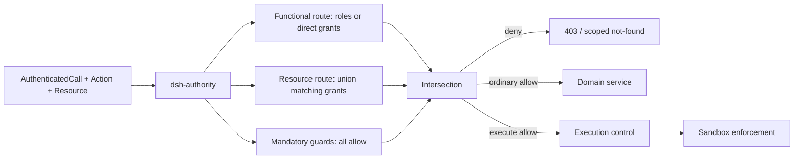
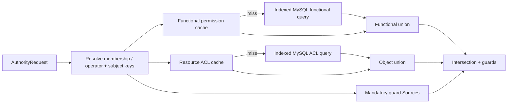
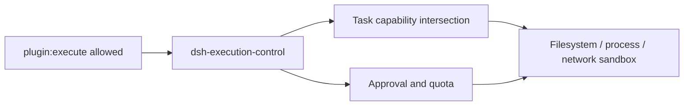

# Authorization architecture

English | [中文](authorization.zh.md)

This reference defines the proposed authorization architecture for multi-user deployments. Authentication and token lifecycle remain owned by the [authentication subsystem](../subsystems/authentication.md); this design starts from an authenticated call and decides whether that principal may perform one action on one resource. The principal and tenant rules come from [identity and access](identity-and-access.md).

Open the self-contained [interactive authorization data-flow demo](authorization-data-flow.html) to explore the request path, overall architecture, storage model, change propagation, and seven example decisions.

## Ownership and package roles

Authorization has one public entry point and distributed implementations. `dsh-authority` locates the relevant Providers and combines their decisions, while each Provider owns one kind of rule and reads data through a replaceable Source. The center never queries RBAC or domain tables directly.

`dsh-authority` injects non-removable baseline slots for call currency, scope binding, credential ceiling, deployment policy, and local/server profile separation according to the action plane. Each `ActionDefinition` may only add stable named slots for functional grants, relationship grants, and domain guards; it cannot remove or replace the baseline. A Provider registers one unique Provider id into one slot keyed by plane, resource type, action, contribution kind, and slot id. This lets ACL, ownership, lifecycle, hierarchy, and deployment Providers coexist without relying on registration order. Each required slot has exactly one live Provider; duplicate registration fails, static absence fails composition, and runtime loss denies. Additive slots may be optional, but an action still needs a non-empty functional and relationship result, so an empty Provider set never allows.

| Component | Responsibility | Persistence |
|---|---|---|
| `dsh-authority` | `Action` catalog, Provider registry, `decide`, `require`, collection scopes, decision merge, and trace | None |
| `dsh-auth-rbac` | Human role, service-account direct grant, local-profile grant, and platform-operator functional evaluation | `RbacPolicySource` |
| `dsh-auth-rbac-mysql` | Roles, membership-role assignments, direct grants, and revisions | MySQL |
| `dsh-authority-acl` | Resource grants for user/service-account memberships, roles, tenants, and everyone | `ResourceGrantSource` |
| `dsh-authority-acl-mysql` | Resource grant rows and ACL revisions | MySQL |
| `dsh-authority-evidence-mysql` | Shared delegated-evidence head ledger, reduction fences, and fence scanner | MySQL |
| `dsh-authority-redis` | Versioned compiled role and resource read models with MySQL fallback | Redis |
| Domain Authority Provider | Ownership, lifecycle, hierarchy, and resource-specific rules | Domain Source |
| `dsh-execution-control` | Task capabilities, approval, quota, and sandbox restrictions after execution authorization | Domain stores |

Domain plugins register stable actions and their own Authority Providers. They do not implement a second authorization entry point, inspect RBAC tables, or trust a boolean supplied by another service. Every protected domain operation calls `require()` inside its own boundary; a transport-level `decide()` precheck may fail early for user experience but never replaces the domain check, and a plain `Decision` is not an authorization capability.

## Request and action model

A protected domain operation binds the server-owned action and asks its scoped repository for only the authorization projection needed by the relevant Providers. Client input may identify a target, but it cannot assert the target owner, tenant, status, authorization plane, or authorization profile. The `AuthorityCallContext` is derived from the exact `AuthenticatedCall` and trusted membership or operator state as defined by [identity and access](identity-and-access.md).

```text
AuthorityRequest = {
  context: {
    call: AuthenticatedCall,
    scope:
      | { kind: "tenant", tenantId: TenantId, membershipId: MembershipId }
      | { kind: "platform", operatorGrantId: OperatorGrantId }
  },
  action: ActionCode,
  resource: {
    type: ResourceType,
    id: ResourceId,
    revision?: number
  }
}
```

Before evaluation, `dsh-authority` proves that the exact call remains current, checks the scope adapter's process-local provenance, and re-resolves its full binding. A tenant binding is `(membershipId, tenantId, principal kind/id, active status)`; a platform binding is `(operatorGrantId, call user id, active status, expiry)`. A tenant resource lookup always uses `(context.scope.tenantId, resource.id)`. A platform scope is accepted only by platform actions and never authorizes a tenant action or tenant content access.

An action has a stable `{plane}:{resourceType}:{actionCode}` identity, a `tenant` or `platform` plane, a `collection` or `instance` target scope, an owning plugin, and a `delegable` flag. Every action has a `use` check; a delegable action additionally has a `delegate` check.

This document writes a grant as `{action}/use` or `{action}/delegate` for clarity. The slash suffix is the grant kind, not part of `ActionCode`; for example, `plugin:execute/delegate` means action `plugin:execute` with grant kind `delegate`.

- The base template registers `create`, `read`, `update`, and `delete`; their optional delegation checks produce the familiar eight base permissions.
- Domain plugins may add `execute`, `publish`, `configure`, `fork`, `export`, `install`, or other stable actions without changing the grant tables.
- A `delegate` grant permits assigning or revoking another subject's `use` grant for that action on the same resource scope. It does not permit assigning `delegate` itself; owner or explicit authorization-administration policy controls that operation.

Action definitions are registered by code and synchronized idempotently into the action catalog with their required slot manifest. Static absence or conflict of a required Provider fails composition; an unknown, disabled, or retired action fails closed at runtime, while durable grants retain stable action ids for audit and cleanup. Platform operator grants use a separate platform Source and never enter tenant role tables.

## Decision composition

Functional grant Providers and relationship grant Providers are additive only inside their own route. For a tenant-scoped human, functional permissions are the union of the active membership's role grants. A service account uses bounded direct membership grants, a local profile uses composition-owned local grants, and a platform user uses direct operator grants from the platform Source. Resource permissions are the union of matching membership, role, tenant, and everyone grants plus affirmative domain grants such as ownership.

Mandatory guard Providers are not additive. Every guard selected for an action must return `allow`; `deny`, `abstain`, timeout, Source error, a stale revision, or a missing runtime registration vetoes the request, and no grant can override it. Active membership, credential ceilings, resource lifecycle, administrative hierarchy, and deployment restrictions are guards.

Each additive evidence contributes an action plus constraints. Alternative evidence inside one route combines by union; the functional-route result, relationship-route result, credential ceiling, and every guard constraint combine by intersection. An action definition owns any domain-specific union and intersection operators; an unknown constraint kind, missing operator, or contradictory intersection denies.

Credential ceilings come from an authority Source keyed by safe `AuthenticatedCall` facts such as `credentialId`; authorization never reparses the raw token, and `dsh-auth` remains identity-only. A normal short-lived access credential limits the current grant operation but does not become the durable origin or expiry of the resulting share. Only an action that explicitly supports credential-bound grants records a stable credential-policy or token-family revision and its delegation horizon; it never binds durable authority to an access-token jti.

```text
FunctionalUse =
  tenant human: union(active membership role use grants)
  tenant service account: union(active direct membership use grants)
  local profile: composition-owned local use grants
  platform user: union(active operator use grants)
ObjectUse = union(matching resource use grants and affirmative domain grants)
GuardPass = all(required guards return allow)
EffectiveUse = GuardPass ? FunctionalUse intersect ObjectUse : empty

FunctionalDelegate =
  tenant human: union(active membership role delegate grants)
  tenant service account: empty
  local profile: composition-owned local delegate grants
  platform user: empty
ObjectDelegate = union(matching resource delegate grants and affirmative domain grants)
EffectiveDelegate = GuardPass ? FunctionalDelegate intersect ObjectDelegate : empty
```

- Both routes must contain the requested action; a grant on one route never compensates for a missing grant on the other.
- A resource owner receives explicit object grants or a domain ownership decision; ownership is not a hidden bypass around functional permission.
- `create` checks the parent collection because the new instance does not exist yet. The creation transaction writes the new resource and its initial owner grants together.
- Local grants and synthesized membership exist only in an explicit local profile; a mandatory profile guard rejects a local principal in every server composition.
- Platform administration uses an explicit platform-scoped action, operator `use` grant, relationship grant, and domain guard; operator assignment or removal uses the out-of-band bootstrap or a separate platform-administration protocol. No `super-admin` label bypasses tenant or resource checks or reveals tenant content.
- A grant Provider's `abstain` contributes nothing. A mandatory guard's `abstain` denies because the required invariant was not established.



The decision runtime may query independent Providers concurrently after it resolves the active membership or operator grant and subject keys. It waits for every required result, applies vetoes before additive unions, and emits one deterministic `Decision` with reason codes, revisions, and enforceable constraints. Parallelism is internal and never changes the merge order or failure semantics.

## Persistence model

MySQL stores normalized, explainable authority data. It never stores eight expanding user lists inside a resource row, and it does not persist a denormalized final union for every principal.

| Table | Key data | Revision owner |
|---|---|---|
| `dsh_authz_actions` | action id, plane, resource type, code, target scope, delegable, required slot manifest, owner plugin, status | Action catalog revision |
| `dsh_authz_roles` | tenant, role id, code, status | Role revision |
| `dsh_authz_membership_roles` | tenant, membership id, role id | Membership authorization revision |
| `dsh_authz_service_account_action_grants` | tenant, membership id, action id, expiry, typed constraint, grantor | Membership authorization revision |
| `dsh_authz_membership_versions` | tenant, membership id, current authorization revision | Membership authorization revision |
| `dsh_authz_role_action_grants` | tenant, role id, action id, `use` or `delegate`, typed constraint | Role revision |
| `dsh_authz_platform_operator_assignments` | operator grant id, user id, status, expiry, current revision | Platform grant revision |
| `dsh_authz_platform_operator_actions` | operator grant id, action id, typed constraint | Platform grant revision |
| `dsh_authz_resource_action_grants` | grant id, tenant, resource type/id, subject kind/id, action id, grant kind, issuance kind, expiry, typed constraint, grantor, evidence revision | Grant evidence revision + resource ACL read-model revision |
| `dsh_authz_resource_grant_origins` | grant id, source id, evidence key/revision, maximum expiry | Supporting evidence revision |
| `dsh_authz_evidence_heads` | source id, evidence key, current revision, stable/fenced state, expiry | Supporting evidence revision |
| `dsh_authz_resource_acl_versions` | tenant, resource type/id, current revision | Resource ACL revision |

Actions are unique by `(plane, resource_type, code)`. Membership-role assignments use `(tenant_id, membership_id, role_id)`. Service-account direct grants use `(tenant_id, membership_id, action_id)` and carry `use` only. Platform operator actions also carry `use` only. The role grant unique key is `(tenant_id, role_id, action_id, grant_kind)`. Resource grant subjects are `user-membership`, `service-account-membership`, `role`, `tenant`, or `everyone`; membership subject ids prevent a removed principal from regaining an old grant by joining again.

Each resource grant has a stable `GrantId`. Its idempotency key includes tenant, resource, subject, action, grant kind, and grantor, so independent grant evidence from two grantors does not collapse into one row. Grantor and origin are discriminated references, not untyped ids. Issuance kind explicitly distinguishes intrinsic owner/system policy from delegated authority; every delegated row must have one or more origin rows, and missing origins never convert it into an intrinsic grant. A reverse index on `(tenant_id, subject_kind, subject_id, resource_type, action_id, resource_id)` supports collection queries; indexes on grantor, supporting evidence, and `expires_at` support bounded invalidation and expiry without making time part of grant identity.

Any Provider contribution that may support a durable delegated grant returns a typed evidence reference and registers one evidence Source under its unique `sourceId`. Membership, role, exact ACL-grant row, ownership fact, domain-policy record, and credential-policy record are separate stable evidence keys. The common protocol is batched and contains no domain query language:

```text
DelegationEvidence = { sourceId, evidenceKey, revision, expiresAt? }
DelegationEvidenceSource = {
  sourceId
  resolveCurrentHeads(evidenceKeys[]) ->
    [{ evidenceKey, state: "stable", revision, expiresAt? }
     | { evidenceKey, state: "fenced" | "missing" }]
  preFence([{ evidenceKey, expectedRevision, reservedRevision }]) -> FenceReceipt
  publishCommittedHeads(FenceReceipt, [{ evidenceKey, revision, expiresAt? }])
  rollbackFence(FenceReceipt)
}
```

`dsh_authz_evidence_heads` is a normalized revision ledger, not a copy of RBAC or domain policy. Evidence Sources publish their heads there and may mirror them in Redis. `dsh-authority` groups references by `sourceId`, deduplicates their keys, and makes one `resolveCurrentHeads` call per Source or bounded batch. The Source must return exactly one result for every requested key from one stable primary snapshot. A missing, expired, fenced, omitted, duplicate, stale, timed-out, or failed result denies every dependent grant. A Source that cannot implement the read, pre-fence, publish, rollback, and reconciliation contract may still contribute to the current decision as a guard, but its result cannot become the origin of a durable delegated grant.

The aggregate resource ACL revision invalidates a resource read-model payload; it is never recorded as the supporting origin of a new grant. ACL support refers to the exact pre-existing grant row's `GrantId` evidence key and row revision, while ownership and domain support refer to their own stable facts. Creating another grant advances the aggregate ACL revision but not those supporting evidence heads, so the new grant cannot invalidate itself or unrelated grants. Changing or deleting a supporting row pre-fences and advances that row's own evidence head. If an origin-capable Source exposes only an aggregate semantic head that the same grant transaction must advance, the transaction reserves and records the post-commit revision; recording the observed pre-commit revision is invalid. The grant transaction captures or reserves all origin revisions after its locked recheck.

Every persisted constraint stores a schema kind, schema version, and canonical typed payload or a stable reference to one. The owning `ActionDefinition` validates it and supplies the versioned union/intersection operators before either MySQL or Redis may contribute the evidence. Unknown or retired constraint versions deny rather than widening to an unconstrained action. Domain Sources apply the same contract to evidence in their own stores.

Membership authorization, role, platform grant, action catalog, and resource ACL revisions advance in the same transaction as their owned records. Deleting the last grant still advances its revision, so a cache cannot mistake removal for an unchanged empty result.

## Read path and cache

Redis stores disposable, versioned read models. MySQL remains authoritative, and a Redis miss or version mismatch performs an indexed MySQL read before refilling the cache.



- `authz:actions:head` points to the current catalog revision; `authz:actions:v:{revision}` stores the stable action-to-ordinal mapping.
- `authz:membership:{tenant}:{membership}:head` points to the membership authorization revision; `...:v:{revision}` stores active role references or bounded service-account direct grants with their expiry and constraints.
- `authz:role:{tenant}:{role}:{resourceType}:head` points to the role revision; `...:v:{revision}` stores compiled `use` and `delegate` action sets. Platform operator grants use an equivalent `authz:platform:{operatorGrantId}` head and payload.
- `authz:resource:{tenant}:{resourceType}:{resourceId}:head` points to the ACL revision; `authz:resource:{tenant}:{resourceType}:{resourceId}:{subjectFingerprint}:v:{revision}` stores only grants matching the canonical ordered membership, role, tenant, and everyone subject keys. The fingerprint is a collision-resistant digest over the complete kind/id list, while the payload also stores that original list for exact equality checking.
- `authz:evidence:{sourceId}:{evidenceKeyDigest}:head` mirrors a stable or fenced evidence head; its payload retains the original evidence key for exact equality checking.
- The payload may use catalog-versioned ordinals or chunked bitmaps; MySQL keeps normalized action rows, so runtime optimization never creates a 64-action schema limit.

A read resolves the stable head from the Redis primary, reads only that immutable revision payload, and confirms that the head did not change while the payload was selected. Authorization never reads an unacknowledged replica. A missing head or payload, changed head, unknown catalog revision, fingerprint collision, or exact subject-key mismatch falls back to indexed MySQL and refills Redis.

For instance decisions, the runtime deduplicates every delegated-origin reference, groups them by `sourceId`, and resolves each group in one batch. It never calls a Source once per grant or once per resource.

Every expiry-bearing MySQL query filters `(expires_at IS NULL OR expires_at > now)`, where `NULL` explicitly means no time limit. Redis payloads preserve each evidence expiry and constraints, filter them again on every decision, and have a TTL no later than their earliest finite expiry; cleanup jobs are never the expiry boundary. Head changes use atomic monotonic compare-and-set, so a delayed writer cannot move revision 3 back to revision 2.

Before committing any evidence-reducing mutation, the owning Source reserves the next revision and calls `preFence` to install a fail-closed `deny-until:{revision}` state in the durable head ledger and on the Redis primary. If either fence cannot be established, the Source does not commit. After commit, it calls `publishCommittedHeads` to replace the fence with the stable head and immutable revision payload by monotonic compare-and-set before reporting completion. A known rollback calls `rollbackFence` with the matching receipt; an independent fence scanner also reconciles every `deny-until` state against the authoritative Source revision, including fences left before any outbox row existed. Redis failover is permitted only after every promotion-eligible replica acknowledges the pre-fence, or after the promoted node discards authorization keys and fails closed until rehydration. A failure can therefore leave stale deny, never stale allow. Grant propagation may remain conservatively stale-deny, and CDC repairs additional consumers asynchronously; neither is an immediate authorization boundary.

The first implementation can pipeline functional, resource, and guard reads after resolving the membership or operator grant. A final functional-union cache is optional and keyed by the membership revision plus ordered role-id/revision fingerprint, or by the platform-grant revision. It is never authoritative and does not require rewriting every affected user when one role changes.

## Delegation and revocation

Delegation uses the same two routes and mandatory guards as ordinary use, but evaluates `EffectiveDelegate` against the exact grant change. It is an authorization-administration operation, not a second meaning hidden inside ordinary `use`.

```text
GrantChangeRequest =
  | {
      operation: "grant",
      context: AuthorityCallContext,
      resource: { type, id, revision },
      proposedGrant: {
        action,
        grantKind: "use",
        recipient: { kind: "user" | "service-account", membershipId },
        targetScope,
        expiresAt,
        constraints
      }
    }
  | {
      operation: "revoke",
      context: AuthorityCallContext,
      resource: { type, id, revision },
      grantId: GrantId
    }

proposedGrant subset-of EffectiveDelegate.constraints
```

- The recipient must have an active membership in the same tenant. Ordinary delegation targets a user or service account, not a role, tenant, everyone, platform operator, owner, or system subject; broader grants require a separate authorization-administration action.
- The proposed grant carries `use` only. It cannot grant `delegate`, change the action, widen an instance scope to a collection, or exceed the delegator's resource scope.
- Its constraints must fit the effective `use`/`delegate` authority and the current credential ceiling. Its own expiry cannot exceed the supporting durable authority or domain policy maximum. Access-token expiry only limits the current request unless an explicit credential-bound grant policy defines a shorter delegation horizon. Service accounts cannot delegate in the first release.
- For revoke, the service loads the actual grant by `(tenant, resource type/id, GrantId)` and authorizes that stored action, recipient, grantor, origin, expiry, and constraints. It never accepts a caller-supplied proposed row. An ordinary delegator revokes only a grant issued by the same membership; revoking another grantor's, owner, or system grant requires the separate administration action.
- Grant or revoke writes the normalized MySQL row, advances the owning revision, and appends an outbox event in one transaction.
- The write transaction rechecks membership, action catalog, role/direct-grant, resource ACL, and domain revisions. A stale decision retries or denies instead of committing from an earlier allow.
- A delegated grant is conditional, not an independent permanent authority. Its origin rows bind it to the exact durable membership, functional, resource, and domain-policy evidence that supported delegation, plus stable credential-policy evidence only for an explicitly credential-bound grant. Reads batch the exact origin keys through their registered evidence Sources; any missing, fenced, expired, or revision-mismatched head excludes the grant until it is re-evaluated. A reducing mutation pre-fences the changed supporting-evidence keys before reporting completion, so all dependent grants fail closed without synchronous fan-out; reverse-index cleanup and affected resource ACL rewrites run asynchronously.
- Disabling or removing a grantor membership, removing a supporting role or resource grant, transferring ownership, tightening a credential ceiling, or changing a mandatory policy therefore invalidates dependent grants. Because `delegate` cannot grant `delegate`, the first release has no recursive delegation chain.
- After commit, the writer synchronously publishes the affected durable and Redis evidence heads before reporting every authorization-reducing revoke as complete.
- CDC propagates changes to additional caches, search projections, and reconcilers asynchronously; it is not the immediate security boundary.
- Grant propagation may conservatively delay access, but stale cache state must not continue any revoked access after completion.

## Collection operations

Collection operations do not authorize every returned row one at a time. `dsh-authority` resolves a structured access scope containing the active tenant, subject keys, requested action, and relevant revisions; the owning repository converts that scope into indexed SQL or a projection predicate.

For the MySQL ACL Source, the scope is an indexed relation that joins matching grant origins to `dsh_authz_evidence_heads`; a delegated grant enters the scope only when it has at least one origin and an anti-join finds no missing, fenced, expired, or revision-mismatched head. A search or external-store projection must carry the same origin/head fields and a current reduction-fence watermark; if it cannot prove that watermark, it fails closed or falls back to the MySQL authority relation before returning rows, counts, or facets. This is a batched relation check, never a remote call per row or per grant.

Matching relationship predicates combine with `OR`, while mandatory tenant, lifecycle, classification, and domain guard predicates combine with `AND`. A repository must apply the complete expression before computing rows, counts, aggregates, cursors, or search facets.

- `list`, `search`, `count`, and `export` filter by matching membership, role, tenant, or everyone grants before resource data leaves storage.
- `create` authorizes the parent collection, checks domain quota separately, and creates the instance plus initial owner grants atomically.

The authorization layer returns subject and action constraints rather than raw SQL. Domain storage plugins retain query ownership and cannot expose an unscoped fallback method.

## Plugin and Agent execution

`plugin:execute` means that the actor may request execution of that plugin instance. It does not grant filesystem, subprocess, network, secret, Git, database, or external-message authority.



Execution control intersects the user's permitted operation, the plugin's declared requirements, deployment policy, task-scoped grants, and approval result. The real sandbox enforces the result; an unenforceable required restriction rejects execution.

## Representative cases

| Request | Functional route | Resource route | Result | Next step |
|---|---|---|---|---|
| Run a shared plugin | Role grants `plugin:execute/use` | Plugin grants `plugin:execute/use` | Allow | Execution control and sandbox |
| Service account runs a plugin | Membership directly grants `plugin:execute/use` | Plugin grants that service-account membership `plugin:execute/use` | Allow | Execution control without human approval identity |
| Local profile runs its plugin | Local composition grants `plugin:execute/use` | Synthesized local owner relationship grants `plugin:execute/use`; profile guard allows | Allow | Local execution policy |
| Run with viewer role | Role lacks `plugin:execute/use` | Plugin grants `plugin:execute/use` | Deny | No runtime allocation |
| Edit a read-only share | Role grants `plugin:update/use` | Plugin grants only `plugin:read/use` | Deny | No update transaction |
| Delegate plugin execution | Role and plugin grant kind is `delegate` for action `plugin:execute`; recipient and expiry are bounded | Requested grant is `plugin:execute/use` | Allow | Write one recipient grant with its own `GrantId` |
| List visible plugins | Role grants `plugin:read/use` | Scope contains membership, roles, tenant, and everyone | Allow with scope | One indexed authority relation plus one scoped resource query |
| Create a plugin | Role grants `plugin:create/use` | Parent collection grants `plugin:create/use` | Allow | Create plugin and owner grants atomically |
| Disable a tenant membership | Role grants `membership:disable/use` | Tenant relationship Provider grants management of the target; hierarchy guard allows | Allow | Membership transaction and token revocation |
| Suspend a platform user | Operator grant contains `platform-user:suspend/use` | Platform relationship Provider grants the target action; status and hierarchy guards allow | Allow | Control-plane transaction without tenant content access |

## Failure and audit

- Authentication failure returns `401`; authorization denial after a valid call returns `403` unless resource concealment requires the same not-found response used for an absent resource.
- A scoped resource lookup precedes content disclosure. A valid id from another tenant does not reveal existence, owner, grants, or policy details.
- Decision traces record request id, principal, scope, action, bounded resource identity, grant contributions, guard outcomes, constraints, revisions, reason codes, and final outcome.
- Audit records exclude raw tokens, passwords, secret values, message bodies, tool output, and unrestricted policy graphs.
- A business transaction rechecks required resource or policy revisions when a high-risk decision could become stale before commit.

This architecture centralizes discovery, composition, failure semantics, and audit without centralizing domain queries. Functional policy, resource relationships, business invariants, persistence, and execution restrictions remain replaceable owners behind one authorization API.
