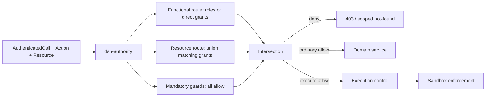
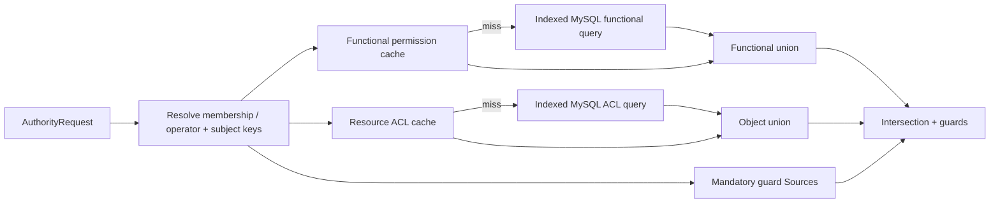
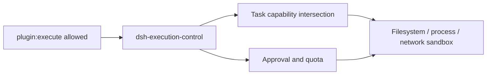

# 授权架构

[English](authorization.md) | 中文

本文定义多用户部署提案中的授权架构。认证和 token 生命周期继续归[认证子系统](../subsystems/authentication.md)所有；本设计从已认证调用开始，判断该 principal 能否对一项资源执行一个动作。Principal 与租户规则见[身份与访问控制](identity-and-access.md)。

打开自包含的[授权数据流交互演示](authorization-data-flow.html)，可以查看请求路径、整体架构、存储模型、变更传播和七个授权案例。

## 职责与插件角色

授权提供一个公共入口和分散的实现。`dsh-authority` 定位相关 Provider 并合并其决定，每个 Provider 拥有一类规则，并通过可替换 Source 读取数据。中心插件不直接查询 RBAC 或领域表。

`dsh-authority` 根据 action plane 注入不可删除的 call currency、scope binding、credential ceiling、deployment policy 和 local/server profile separation baseline slot。每个 `ActionDefinition` 只能增加稳定的命名 functional grant、relationship grant 和 domain guard slot，不能删除或替换 baseline。Provider 使用唯一 Provider id 注册到一个 slot，其 key 包含 plane、resource type、action、contribution kind 和 slot id。这样 ACL、ownership、lifecycle、hierarchy 和 deployment Provider 可以共存，并且不依赖注册顺序。每个 required slot 必须恰好有一个 live Provider；重复注册会失败，静态缺失使组合失败，运行时丢失则拒绝。增量 slot 可以是可选的，但 action 仍需要非空功能结果和关系结果，因此空 Provider 集合永远不会放行。

| 组件 | 职责 | 持久化 |
|---|---|---|
| `dsh-authority` | `Action` 目录、Provider 注册表、`decide`、`require`、集合 scope、决定合并与轨迹 | 无 |
| `dsh-auth-rbac` | 人类角色、service-account 直接 grant、local-profile grant 与 platform-operator 功能判断 | `RbacPolicySource` |
| `dsh-auth-rbac-mysql` | 角色、membership-role 分配、直接 grant 与 revision | MySQL |
| `dsh-authority-acl` | 面向 user/service-account membership、role、tenant 和 everyone 的资源授权 | `ResourceGrantSource` |
| `dsh-authority-acl-mysql` | 资源授权记录与 ACL revision | MySQL |
| `dsh-authority-evidence-mysql` | 共享 delegated-evidence head 台账、降权 fence 与 fence scanner | MySQL |
| `dsh-authority-redis` | 带版本的角色与资源编译读取模型，并在未命中时回源 MySQL | Redis |
| 领域 Authority Provider | 所有权、生命周期、管理层级与资源特有规则 | 领域 Source |
| `dsh-execution-control` | 执行授权后的任务能力、审批、配额与沙箱限制 | 领域存储 |

领域插件注册稳定动作和自己的 Authority Provider。它们不实现第二个授权入口，不检查 RBAC 表，也不信任其他服务传入的布尔值。每项受保护领域操作都在自身边界内调用 `require()`；传输层 `decide()` 预检可以为用户体验提前失败，但永远不能代替领域检查，普通 `Decision` 也不是授权 capability。

## 请求与动作模型

受保护领域操作绑定由服务端拥有的动作，并让自身有 scope 的 repository 只加载相关 Provider 所需的授权 projection。客户端输入可以标识目标，但不能断言目标 owner、tenant、status、授权 plane 或授权 profile。`AuthorityCallContext` 按[身份与访问控制](identity-and-access.md)的定义，从原样 `AuthenticatedCall` 和可信 membership 或 operator 状态派生。

```text
AuthorityRequest = {
  context: {
    call: AuthenticatedCall,
    scope:
      | { kind: "tenant", tenantId: TenantId, membershipId: MembershipId }
      | { kind: "platform", operatorGrantId: OperatorGrantId }
  },
  action: ActionCode,
  resource: {
    type: ResourceType,
    id: ResourceId,
    revision?: number
  }
}
```

判断前，`dsh-authority` 证明原样 call 仍有效，检查 scope adapter 的进程内 provenance，并重新解析完整绑定。Tenant 绑定为 `(membershipId, tenantId, principal kind/id, active status)`；platform 绑定为 `(operatorGrantId, call user id, active status, expiry)`。租户资源查询始终使用 `(context.scope.tenantId, resource.id)`。Platform scope 只接受 platform action，永远不能授权 tenant action 或租户内容访问。

动作具有稳定的 `{plane}:{resourceType}:{actionCode}` identity、`tenant` 或 `platform` plane、`collection` 或 `instance` target scope、所属插件和 `delegable` 标志。每个动作都有 `use` 检查；可转授动作还具有 `delegate` 检查。

为清楚起见，本文把 grant 写作 `{action}/use` 或 `{action}/delegate`。斜杠后缀是 grant kind，不是 `ActionCode` 的组成部分；例如 `plugin:execute/delegate` 表示 action 为 `plugin:execute`、grant kind 为 `delegate`。

- 基础模板注册 `create`、`read`、`update` 和 `delete`；它们的可选转授检查形成常见的八项基础权限。
- 领域插件可以增加 `execute`、`publish`、`configure`、`fork`、`export`、`install` 或其他稳定动作，而不修改授权表结构。
- `delegate` grant 允许在相同资源 scope 上分配或撤销另一个主体对该动作的 `use` grant。它本身不允许分配 `delegate`；owner 或显式授权管理策略控制该操作。

动作定义由代码注册，并连同 required slot manifest 以幂等方式同步到动作目录。必选 Provider 的静态缺失或冲突使组合失败；未知、已禁用或已退役的 action 在运行时默认拒绝，持久 grant 保留稳定 action id 以供审计和清理。Platform operator grant 使用独立 platform Source，永远不进入租户 role 表。

## 决定组合

功能 grant Provider 和关系 grant Provider 只在各自路线内叠加。对 tenant-scoped 人类而言，功能权限是 active membership 所有 role grant 的并集。Service account 使用有界直接 membership grant，local profile 使用组合所有的 local grant，platform 用户则使用 platform Source 的直接 operator grant。资源权限是匹配的 membership、role、tenant 和 everyone grant，加上所有权等肯定性领域 grant 的并集。

必选 guard Provider 不可叠加。为某项 action 选择的每个 guard 都必须返回 `allow`；`deny`、`abstain`、超时、Source 错误、陈旧 revision 或运行时缺少注册都会否决请求，并且任何 grant 都不能覆盖。Active membership、credential ceiling、resource lifecycle、administrative hierarchy 和 deployment restriction 都属于 guard。

每项增量 evidence 贡献一个 action 与 constraint。同一路线内的替代 evidence 取并集；功能路线结果、关系路线结果、credential ceiling 和每项 guard constraint 取交集。Action definition 拥有领域特有的 union 与 intersection operator；constraint kind 未知、缺少 operator 或交集矛盾时拒绝。

Credential ceiling 来自 authority Source，并以 `credentialId` 等安全 `AuthenticatedCall` 事实作为 key；授权永远不会重新解析 raw token，`dsh-auth` 仍只负责身份。普通短期 access credential 限制当前 grant operation，但不会成为最终 share 的持久 origin 或 expiry。只有显式支持 credential-bound grant 的 action 才记录稳定 credential-policy 或 token-family revision 及其 delegation horizon；持久权限永远不绑定 access-token jti。

```text
FunctionalUse =
  tenant human: union(active membership role use grants)
  tenant service account: union(active direct membership use grants)
  local profile: composition-owned local use grants
  platform user: union(active operator use grants)
ObjectUse = union(matching resource use grants and affirmative domain grants)
GuardPass = all(required guards return allow)
EffectiveUse = GuardPass ? FunctionalUse intersect ObjectUse : empty

FunctionalDelegate =
  tenant human: union(active membership role delegate grants)
  tenant service account: empty
  local profile: composition-owned local delegate grants
  platform user: empty
ObjectDelegate = union(matching resource delegate grants and affirmative domain grants)
EffectiveDelegate = GuardPass ? FunctionalDelegate intersect ObjectDelegate : empty
```

- 两条路线都必须包含请求动作；一条路线上的 grant 永远不能补偿另一条路线缺失的 grant。
- 资源 owner 获得显式对象 grant 或领域所有权决定；所有权不是绕过功能权限的隐式旁路。
- `create` 检查父集合，因为新实例尚不存在。创建事务同时写入新资源及其初始 owner grant。
- Local grant 与 synthesized membership 只存在于显式 local profile；必选 profile guard 在每个 server composition 中拒绝 local principal。
- 平台管理使用显式 platform-scoped action、operator `use` grant、relationship grant 和领域 guard；operator assignment 或 removal 使用带外 bootstrap 或独立 platform-administration 协议。不存在绕过租户或资源检查或者披露租户内容的 `super-admin` 标签。
- Grant Provider 的 `abstain` 不贡献任何权限。必选 guard 的 `abstain` 会拒绝，因为必要不变量并未得到证明。



决定运行时可以在解析 active membership 或 operator grant 和 subject key 后，并发查询相互独立的 Provider。它等待每个必选结果，在叠加 grant 前应用 veto，并生成一个包含 reason code、revision 和可执行约束的确定 `Decision`。并行只属于内部实现，永远不会改变合并顺序或失败语义。

## 持久化模型

MySQL 保存规范化、可解释的授权数据。它不会在资源记录内保存八个不断扩大的用户 list，也不持久化每个 principal 的反规范化最终并集。

| 表 | 关键数据 | Revision 所有者 |
|---|---|---|
| `dsh_authz_actions` | action id、plane、resource type、code、target scope、delegable、required slot manifest、owner plugin、status | Action catalog revision |
| `dsh_authz_roles` | tenant、role id、code、status | Role revision |
| `dsh_authz_membership_roles` | tenant、membership id、role id | Membership authorization revision |
| `dsh_authz_service_account_action_grants` | tenant、membership id、action id、expiry、typed constraint、grantor | Membership authorization revision |
| `dsh_authz_membership_versions` | tenant、membership id、current authorization revision | Membership authorization revision |
| `dsh_authz_role_action_grants` | tenant、role id、action id、`use` 或 `delegate`、typed constraint | Role revision |
| `dsh_authz_platform_operator_assignments` | operator grant id、user id、status、expiry、current revision | Platform grant revision |
| `dsh_authz_platform_operator_actions` | operator grant id、action id、typed constraint | Platform grant revision |
| `dsh_authz_resource_action_grants` | grant id、tenant、resource type/id、subject kind/id、action id、grant kind、issuance kind、expiry、typed constraint、grantor、evidence revision | Grant evidence revision + resource ACL read-model revision |
| `dsh_authz_resource_grant_origins` | grant id、source id、evidence key/revision、maximum expiry | Supporting evidence revision |
| `dsh_authz_evidence_heads` | source id、evidence key、current revision、stable/fenced state、expiry | Supporting evidence revision |
| `dsh_authz_resource_acl_versions` | tenant、resource type/id、current revision | Resource ACL revision |

Action 唯一键为 `(plane, resource_type, code)`。Membership-role 分配使用 `(tenant_id, membership_id, role_id)`。Service-account 直接 grant 使用 `(tenant_id, membership_id, action_id)`，并且只携带 `use`。Platform operator action 也只携带 `use`。角色 grant 唯一键为 `(tenant_id, role_id, action_id, grant_kind)`。资源 grant 的 subject 可以是 `user-membership`、`service-account-membership`、`role`、`tenant` 或 `everyone`；使用 membership subject id 可以防止已离开的 principal 重新加入后恢复旧 grant。

每条资源 grant 都有稳定 `GrantId`。其幂等 key 包含 tenant、resource、subject、action、grant kind 和 grantor，因此两个 grantor 的独立 grant 证据不会合并到一条记录中。Grantor 和 origin 使用可判别 reference，而不是无类型 id。Issuance kind 显式区分 intrinsic owner/system policy 与 delegated authority；每条 delegated row 必须具有一条或多条 origin row，origin 缺失绝不能把它变成 intrinsic grant。`(tenant_id, subject_kind, subject_id, resource_type, action_id, resource_id)` 反向索引支持集合查询；grantor、supporting evidence 与 `expires_at` 索引支持有界失效和过期处理，时间不构成 grant identity。

任何可能支持持久 delegated grant 的 Provider contribution 都返回类型化 evidence reference，并以唯一 `sourceId` 注册一个 evidence Source。Membership、role、准确 ACL-grant row、ownership fact、domain-policy record 和 credential-policy record 是彼此独立的稳定 evidence key。公共协议采用批量调用，并且不包含领域查询语言：

```text
DelegationEvidence = { sourceId, evidenceKey, revision, expiresAt? }
DelegationEvidenceSource = {
  sourceId
  resolveCurrentHeads(evidenceKeys[]) ->
    [{ evidenceKey, state: "stable", revision, expiresAt? }
     | { evidenceKey, state: "fenced" | "missing" }]
  preFence([{ evidenceKey, expectedRevision, reservedRevision }]) -> FenceReceipt
  publishCommittedHeads(FenceReceipt, [{ evidenceKey, revision, expiresAt? }])
  rollbackFence(FenceReceipt)
}
```

`dsh_authz_evidence_heads` 是规范化 revision 台账，不是 RBAC 或领域 policy 的副本。Evidence Source 向其中发布 head，并且可以在 Redis 中建立镜像。`dsh-authority` 按 `sourceId` 对引用分组、去重 key，并对每个 Source 发起一次 `resolveCurrentHeads` 调用或有界 batch。Source 必须从一个稳定 primary snapshot 为每个请求 key 恰好返回一个结果。缺失、过期、被 fence、遗漏、重复、陈旧、超时或失败结果都会拒绝所有依赖 grant。无法实现读取、pre-fence、publish、rollback 与 reconciliation 契约的 Source，仍可作为 guard 参与当前决定，但其结果不能成为持久 delegated grant 的 origin。

资源 ACL 的聚合 revision 用于使 resource read-model payload 失效；新 grant 永远不会把它记录为支持 origin。ACL 支持证据引用准确的既有 grant row `GrantId` evidence key 与 row revision，ownership 和领域支持证据则引用各自稳定 fact。创建另一项 grant 会推进聚合 ACL revision，但不会改变这些 supporting evidence head，因此新 grant 不会使自身或无关 grant 失效。修改或删除 supporting row 会先 fence 并推进该 row 自身的 evidence head。如果 origin-capable Source 只能公开同一 grant 事务必须推进的 aggregate semantic head，事务会预留并记录 post-commit revision；记录已观察到的 pre-commit revision 无效。Grant 事务在加锁复核后捕获或预留全部 origin revision。

每项持久 constraint 都保存 schema kind、schema version 和 canonical typed payload，或者保存指向该 payload 的稳定 reference。在 MySQL 或 Redis 贡献 evidence 前，所属 `ActionDefinition` 校验它，并提供带版本的 union/intersection operator。Constraint version 未知或已退役时拒绝，而不是扩大为无约束 action。Domain Source 对自身存储中的 evidence 应用同一契约。

Membership authorization、role、platform grant、action catalog 和 resource ACL revision 在其所属记录变更事务中一起递增。删除最后一条 grant 仍递增所属 revision，因此缓存不会把删除误判成未变化的空结果。

## 读取路径与缓存

Redis 保存可丢弃、带版本的读取模型。MySQL 仍是权威存储；Redis 未命中或版本不一致时，通过索引读取 MySQL 后回填缓存。



- `authz:actions:head` 指向当前 catalog revision；`authz:actions:v:{revision}` 保存稳定 action-to-ordinal 映射。
- `authz:membership:{tenant}:{membership}:head` 指向 membership authorization revision；`...:v:{revision}` 保存 active role reference 或带 expiry 与 constraint 的有界 service-account direct grant。
- `authz:role:{tenant}:{role}:{resourceType}:head` 指向 role revision；`...:v:{revision}` 保存编译后的 `use` 与 `delegate` action set。Platform operator grant 使用对应的 `authz:platform:{operatorGrantId}` head 与 payload。
- `authz:resource:{tenant}:{resourceType}:{resourceId}:head` 指向 ACL revision；`authz:resource:{tenant}:{resourceType}:{resourceId}:{subjectFingerprint}:v:{revision}` 只保存匹配 canonical ordered membership、role、tenant 与 everyone subject key 的 grant。Fingerprint 是对完整 kind/id list 的抗碰撞 digest，payload 同时保存原始 list 以执行精确相等校验。
- `authz:evidence:{sourceId}:{evidenceKeyDigest}:head` 镜像 stable 或 fenced evidence head；其 payload 保留原始 evidence key 以执行严格相等校验。
- Payload 可以使用带 catalog version 的 ordinal 或分段 bitmap；MySQL 保留规范化 action 记录，因此运行时优化不会形成 64 个 action 的 schema 上限。

读取从 Redis primary 解析稳定 head，只读取该不可变 revision payload，并确认选择 payload 的过程中 head 没有变化。授权永远不读取未确认 replica。Head 或 payload 缺失、head 变化、catalog revision 未知、fingerprint 碰撞或精确 subject-key 不匹配时，回源有索引的 MySQL 并回填 Redis。

对于 instance 决定，runtime 对所有 delegated-origin reference 去重，按 `sourceId` 分组，并以一次批量调用解析每组引用。它永远不会针对每项 grant 或每项 resource 单独调用 Source。

每次包含 expiry 的 MySQL 查询都过滤 `(expires_at IS NULL OR expires_at > now)`，其中 `NULL` 明确表示没有时间限制。Redis payload 保留每项证据的 expiry 与 constraint，在每次决定时再次过滤，并且 TTL 不晚于最早有限 expiry；cleanup job 永远不是过期边界。Head 变化使用原子单调 compare-and-set，因此延迟 writer 不能把 revision 3 退回 revision 2。

在提交任何减少 evidence 的 mutation 前，所属 Source 先预留下一个 revision，并调用 `preFence`，向持久 head 台账与 Redis primary 安装 fail-closed `deny-until:{revision}` state。如果任一 fence 无法建立，Source 不会 commit。Commit 后，它调用 `publishCommittedHeads`，在报告完成前以单调 compare-and-set 把 fence 替换为 stable head 与 immutable revision payload。已知 rollback 使用匹配 receipt 调用 `rollbackFence`；独立 fence scanner 还会按权威 Source revision 协调每个 `deny-until` state，包括在任何 outbox row 出现前遗留的 fence。只有每个可提升 replica 都确认 pre-fence，或者提升后的节点丢弃授权 key 并 fail closed 直至重新填充，才允许 Redis failover。因此失败可以留下 stale deny，但绝不能留下 stale allow。Grant 传播可以保持保守的 stale-deny，CDC 异步修复其他 consumer；两者都不承担即时授权边界。

首个实现可以在解析 membership 或 operator grant 后，用 pipeline 并发读取功能、资源和 guard 数据。最终功能并集 cache 属于可选优化，并使用 membership revision 加有序 role-id/revision 指纹，或使用 platform-grant revision 作为 key。它永远不是权威数据，也不要求在一个角色变化时重写所有受影响用户。

## 转授与撤销

转授使用与普通 use 相同的两条路线和必选 guard，但针对准确的 grant change 判断 `EffectiveDelegate`。它是一项授权管理操作，不是隐藏在普通 `use` 中的第二种含义。

```text
GrantChangeRequest =
  | {
      operation: "grant",
      context: AuthorityCallContext,
      resource: { type, id, revision },
      proposedGrant: {
        action,
        grantKind: "use",
        recipient: { kind: "user" | "service-account", membershipId },
        targetScope,
        expiresAt,
        constraints
      }
    }
  | {
      operation: "revoke",
      context: AuthorityCallContext,
      resource: { type, id, revision },
      grantId: GrantId
    }

proposedGrant subset-of EffectiveDelegate.constraints
```

- Recipient 必须在同一租户内具有 active membership。普通转授只面向用户或 service account，不能面向 role、tenant、everyone、platform operator、owner 或 system subject；更广的 grant 需要独立的授权管理 action。
- Proposed grant 只携带 `use`。它不能授予 `delegate`、改变 action、把 instance scope 扩大为 collection，或者超出授权者的 resource scope。
- 其 constraint 必须位于有效 `use`/`delegate` 权限与当前 credential ceiling 内。自身 expiry 不能超过支持它的持久权限或领域 policy 上限。Access-token expiry 只限制当前请求，除非显式 credential-bound grant policy 定义更短的 delegation horizon。首个版本中 service account 不能转授。
- 对 revoke，服务按 `(tenant, resource type/id, GrantId)` 加载真实 grant，并针对该存储记录的 action、recipient、grantor、origin、expiry 和 constraint 授权。它永远不接受调用方提交的 proposed row。普通授权者只能撤销由相同 membership 签发的 grant；撤销其他 grantor、owner 或 system grant 需要独立管理 action。
- Grant 或 revoke 在一个事务中写入规范化 MySQL 记录、递增所属 revision，并追加 outbox event。
- 写入事务重新检查 membership、action catalog、role/direct-grant、resource ACL 和 domain revision。陈旧决定会重试或拒绝，而不是根据较早的 allow 提交。
- Delegated grant 是有条件授权，而不是独立永久权限。其 origin 记录把它绑定到支持转授的准确持久 membership、functional、resource 和 domain-policy 证据；仅对显式 credential-bound grant 绑定稳定 credential-policy evidence。读取通过注册的 evidence Source 批量解析准确 origin key；任何缺失、被 fence、过期或 revision 不匹配的 head 都会排除该 grant，直到重新判断。减少授权的 mutation 在报告完成前 pre-fence 已变化的 supporting-evidence key，因此所有依赖 grant 无需同步 fan-out 就会 fail closed；反向索引清理和受影响 resource ACL rewrite 异步执行。
- 禁用或删除 grantor membership、删除支持它的 role 或 resource grant、转移 ownership、收紧 credential ceiling 或修改必选 policy，都会使依赖 grant 失效。由于 `delegate` 不能授予 `delegate`，首个版本不存在递归转授链。
- Commit 后，writer 在报告每项减少授权的 revoke 完成前，同步发布受影响的持久与 Redis evidence head。
- CDC 异步向其他 cache、search projection 和 reconciler 传播变更；它不承担即时安全边界。
- Grant 传播可以保守地延迟访问，但完成后陈旧 cache 不能继续任何已撤销访问。

## 集合操作

集合操作不会逐条授权每个返回记录。`dsh-authority` 解析包含 active tenant、subject key、请求动作和相关 revision 的结构化 access scope；拥有该资源的 repository 把 scope 转换成索引 SQL 或 projection predicate。

对于 MySQL ACL Source，scope 是把匹配 grant origin 与 `dsh_authz_evidence_heads` 联接起来的索引 relation；delegated grant 必须至少具有一条 origin，并且 anti-join 找不到缺失、被 fence、过期或 revision 不匹配的 head，才会进入 scope。Search 或 external-store projection 必须携带相同的 origin/head 字段和当前 reduction-fence watermark；如果无法证明该 watermark，就会 fail closed，或者在返回 row、count 或 facet 前 fallback 到 MySQL authority relation。这是批量 relation 检查，绝不是按 row 或 grant 发起远程调用。

匹配的关系 predicate 使用 `OR` 合并，必选 tenant、lifecycle、classification 和 domain guard predicate 使用 `AND` 合并。Repository 必须在计算 row、count、aggregate、cursor 或 search facet 前应用完整表达式。

- `list`、`search`、`count` 和 `export` 在资源数据离开存储前，按匹配的 membership、role、tenant 或 everyone grant 过滤。
- `create` 授权父集合，独立检查领域 quota，并以原子方式创建实例与初始 owner grant。

授权层返回 subject 与 action 约束，而不是原始 SQL。领域存储插件继续拥有查询，并且不能暴露无 scope 的回退方法。

## 插件与 Agent 执行

`plugin:execute` 表示 actor 可以请求执行该插件实例。它不授予 filesystem、subprocess、network、secret、Git、database 或 external-message 权限。



执行控制对用户允许的操作、插件声明的要求、部署策略、任务级 grant 和审批结果取交集。真实沙箱强制执行结果；无法落实的必要限制会拒绝执行。

## 代表性案例

| 请求 | 功能路线 | 资源路线 | 结果 | 下一步 |
|---|---|---|---|---|
| 运行共享插件 | 角色授予 `plugin:execute/use` | 插件授予 `plugin:execute/use` | 允许 | 执行控制与沙箱 |
| Service account 运行插件 | Membership 直接授予 `plugin:execute/use` | 插件向该 service-account membership 授予 `plugin:execute/use` | 允许 | 执行控制，不使用人类 approval identity |
| Local profile 运行自己的插件 | Local composition 授予 `plugin:execute/use` | Synthesized local owner relationship 授予 `plugin:execute/use`；profile guard 允许 | 允许 | 本地执行策略 |
| Viewer 角色运行插件 | 角色缺少 `plugin:execute/use` | 插件授予 `plugin:execute/use` | 拒绝 | 不分配运行时 |
| 修改只读分享 | 角色授予 `plugin:update/use` | 插件只授予 `plugin:read/use` | 拒绝 | 不执行更新事务 |
| 转授插件执行权 | 角色与插件对 action `plugin:execute` 的 grant kind 都是 `delegate`；recipient 与 expiry 有界 | 请求的 grant 是 `plugin:execute/use` | 允许 | 写入一条带独立 `GrantId` 的 recipient grant |
| 列出可见插件 | 角色授予 `plugin:read/use` | Scope 包含 membership、role、tenant 和 everyone | 带 scope 允许 | 一次索引 authority relation 加一次 scoped resource query |
| 创建插件 | 角色授予 `plugin:create/use` | 父集合授予 `plugin:create/use` | 允许 | 原子创建插件与 owner grant |
| 禁用租户 membership | 角色授予 `membership:disable/use` | Tenant relationship Provider 授予管理 target；hierarchy guard 允许 | 允许 | Membership 事务与 token 撤销 |
| 停用平台用户 | Operator grant 包含 `platform-user:suspend/use` | Platform relationship Provider 授予 target action；status 与 hierarchy guard 允许 | 允许 | 不访问租户内容的控制平面事务 |

## 失败与审计

- 认证失败返回 `401`；有效调用后的授权拒绝返回 `403`，除非资源隐藏要求使用与不存在资源相同的 not-found 响应。
- 在披露内容前执行带 scope 的资源查询。来自其他租户的有效 id 不会泄露存在性、owner、grant 或策略细节。
- 决定轨迹记录 request id、principal、scope、action、有界 resource identity、grant contribution、guard outcome、constraint、revision、reason code 和最终 outcome。
- 审计记录排除原始 token、password、secret value、message body、tool output 和无限制 policy graph。
- 当高风险决定可能在提交前陈旧时，业务事务重新检查所需 resource 或 policy revision。

该架构集中管理发现、组合、失败语义和审计，而不集中领域查询。功能策略、资源关系、业务不变量、持久化和执行限制在一个授权 API 后继续由可替换所有者负责。
