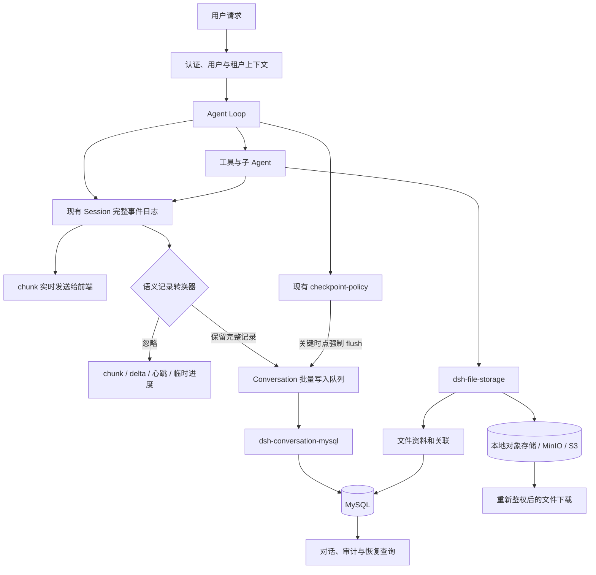
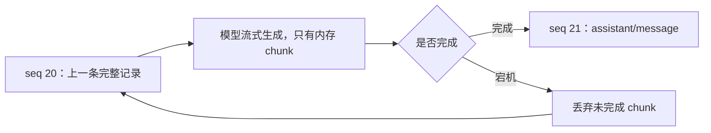

# Conversation 语义记录与 MySQL 持久化

本文定义多用户 Agent 对话的业务记录粒度、MySQL 持久化、崩溃恢复、子 Agent 和文件存储方案。本文是设计提案，不表示相关插件已经交付；现有 Session 日志继续承担无损运行时事件持久化。

## 问题

Agent 的一个用户回合可能产生数百次模型、工具、审批、子 Agent 和文件操作。产品需要把这些有业务意义的操作保存到 MySQL，以便查询对话、审计工具执行、恢复中断任务和展示子 Agent 结果，但不需要把 `assistant/chunk`、reasoning delta、工具参数 delta、WebSocket 帧、心跳或瞬时进度作为业务数据保存。

现有 Session 日志是 Agent 运行时的无损事件源，仍然保存完整 `SessionEvent`，并支持回放、测试和底层恢复。业务 MySQL 不能假装实现无损 `SessionPersistence` 后再静默丢弃 chunk，否则会违反现有接口保证。需要增加独立的语义记录层：它消费 Session 事件，只把完整的小记录投影到业务表。

业务恢复粒度是“一条完整语义记录”。模型生成中途宕机时，未完成的内存 chunk 全部丢弃，恢复从上一条完整记录之后重新生成；系统不从某个 chunk 继续。工具副作用是例外：如果调用已经执行但结果尚未持久化，恢复必须报告结果未知，不能自动重复执行。

## 提案

增加 Provider-neutral 的 Conversation 能力、独立的批量持久化策略和 MySQL Provider。现有 Session 继续拥有运行时完整事件，Conversation 层拥有面向产品查询和按条恢复的语义记录。文件字节由对象存储负责，MySQL 只保存文件资料、所有权和关联。



## 数据分层

### 运行时 Session 日志

现有 `SessionPersistence` 保持不变并继续无损保存 `SessionEvent`。它服务模型上下文重建、精确回放、快照测试和底层 Session 恢复；现有 JSONL、SQLite、批处理协调器和 checkpoint-policy 可以继续工作。

### Conversation 语义日志

Conversation 语义日志只接纳已完成且有业务意义的 `AgentRecord`。建议第一版支持以下类型：

| 类型 | 含义 | 是否是恢复点 |
|---|---|---|
| `user/message` | 一条完整用户消息 | 是 |
| `assistant/message` | 一条完整助手消息 | 是 |
| `assistant/interrupted` | 一次未完成的助手生成及其错误摘要，不含部分文本 | 是 |
| `tool/call` | 已确定的工具名和完整参数 | 是，副作用执行前必须持久化 |
| `tool/result` | 一次工具调用的完整结果或结果引用 | 是 |
| `approval/asked` | 已提出的审批请求 | 是 |
| `approval/decided` | 用户或策略的审批决定 | 是 |
| `subagent/started` | 已创建的子 Session 关系 | 是 |
| `subagent/completed` | 子 Agent 的终态和结果引用 | 是 |
| `file/published` | 文件已经进入对象存储并可被引用 | 是 |
| `turn/completed` | 一个用户回合已经完整结束 | 是 |

`assistant/chunk`、reasoning delta、工具参数 delta、WebSocket 帧、心跳和仅用于界面动画的进度不会生成 `AgentRecord`。失败生成只产生不含部分文本的 `assistant/interrupted`。大段工具输出也不直接放进记录 JSON；第一版默认超过 256 KiB 的完整结果进入对象存储，记录只保存摘要和对象引用，该阈值可以配置。

### 查询投影

`dsh_agent_records` 是追加式语义日志，保存 Agent 过程；`dsh_conversation_messages` 是用户界面的消息投影，保存完整用户消息、助手消息和需要展示的工具消息。投影可以从语义日志核对，但不承担无损 Session 回放。

## 插件划分

### `dsh-conversation`

定义 `ConversationId`、`MessageId`、`AgentRecordId`、记录类型、状态、分页请求、查询结果以及 Provider API。它不依赖 MySQL、Redis、文件系统、JWT 或具体 Session 后端，也不拥有认证与授权规则。

### `dsh-conversation-persistence`

订阅现有 Session 事件并生成语义记录，负责逐 Session 排序、有界批处理、重试、背压和 `flush(sessionId)`。它决定什么时候要求持久化完成，但不包含 SQL。

### `dsh-conversation-mysql`

实现 Conversation Provider，拥有表、索引、schema version、事务、幂等写入、keyset 分页和数据库错误映射。它通过现有 Host-only `ctx.mysql` 获取连接，不修改 MySQL 连接插件。

### `dsh-file-storage` 与 `dsh-file-storage-local`

前者定义流式保存、打开和校验文件的 Provider API；第一版对象不可变且不提供删除接口，只交付后者提供的本地内容寻址实现。MinIO 或 S3 Provider 延后到出现明确部署需求时再增加，替换 Provider 不改变 Conversation 表中的文件标识。

### `dsh-conversation-files-mysql`

保存文件资料、租户和用户所有权、Conversation 关联以及 Message 关联。下载 Consumer 先重新认证和授权，再通过不透明 `storage_key` 打开文件。

### `dsh-conversation-starter`

装配 Conversation、批量策略、MySQL Provider、文件 Provider 和 checkpoint 集成。Redis 与 Elasticsearch 不属于第一版必需依赖。

## MySQL schema

### `dsh_conversations`

一行表示一个顶层或子 Agent 会话。主要字段为 `tenant_id`、`user_id`、`session_id`、`parent_session_id`、`origin`、`delegation_depth`、`title`、`status`、`revision`、`next_sequence`、`retention_policy`、`archive_after`、`created_at`、`updated_at` 和 JSON `extensions`。`next_sequence` 在事务中分配同一 Session 内连续递增的业务序号。第一版 `retention_policy` 默认 `permanent`，即不会自动删除；tenant 后续可以显式配置归档或保留期限，但不能让未授权调用缩短其他用户数据的保留期。

### `dsh_agent_records`

一行表示一条完整语义记录。主要字段为 `tenant_id`、`user_id`、`session_id`、`record_id`、`seq`、`turn_id`、`step_id`、`type`、`status`、`payload`、`idempotency_key`、`occurred_at` 和 JSON `extensions`。`(tenant_id, session_id, seq)` 唯一，`record_id` 和非空 `idempotency_key` 也必须在其作用域内唯一，使批量提交失败后的重试不会插入重复记录。

### `dsh_conversation_messages`

一行表示一条可以直接展示的完整消息。为了与现有 CDC 投影配合，第一版至少保留 `tenant_id`、`user_id`、`session_id`、`message_id`、`revision`、`status`、`visibility`、`role`、`visible_text` 和 `occurred_at`。消息修改通过递增 `revision` 表达；普通 Agent 运行主要追加消息，不在生成期间持续更新同一行。

### `dsh_subagent_runs`

一行表示一次委派，主要字段为 `tenant_id`、`delegation_id`、`parent_session_id`、`child_session_id`、`task_record_id`、`status`、`result_record_id`、`started_at`、`completed_at` 和 JSON `extensions`。子 Agent 的详细记录只保存在子 Session；父 Session 保存关系和最终结果引用，不复制完整记录。

### 文件表

`dsh_file_objects` 保存 `file_id`、`storage_backend`、不透明 `storage_key`、SHA-256、大小、媒体类型、原始文件名、状态和时间。`dsh_conversation_files` 与 `dsh_conversation_message_files` 分别保存文件和 Conversation、Message 的多对多关系。任何表都不保存服务器绝对路径，也不把大文件字节放进 JSON 或 BLOB。

## 写入与 flush 策略

普通语义记录采用固定窗口合并，不使用每条记录一次事务，也不使用会被持续事件无限延后的 debounce。建议首版默认值如下，最终作为可校验配置公开：

```yaml
maxDelayMs: 500
maxBatchRecords: 64
maxBatchBytes: 524288
maxPendingRecords: 4096
flushOnTurnEnd: true
flushOnSubagentComplete: true
flushOnFilePublished: true
flushOnDispose: true
```

达到时间、条数或字节任一上限就提交一个多行事务。同一个 Session 同时最多有一个写入，后续批次按 `seq` 串行提交；不同 Session 可以并行。队列达到上限时必须对生产方施加背压或失败，不能无限占用内存，也不能静默丢记录。

以下时点绕过等待并强制 flush：模型请求需要读取新记录前、顶层工具执行前、外部副作用执行前、文件发布完成时、子 Agent 完成时、回合完成时和插件释放时。现有 checkpoint-policy 已经覆盖模型请求与顶层工具执行前的 Session flush；Conversation 集成必须让同一个检查点同时等待语义队列停稳。

一分钟定时写入不作为默认方案。它可以减少事务，但会让一次崩溃丢失最多一分钟的 Agent 记录，并让执行前审计失去保证。500 ms 固定窗口配合关键时点强制 flush，可以批量写入普通记录，同时缩短普通丢失窗口。

## 崩溃恢复

### 模型生成中宕机

模型 chunk 只发送给前端并在内存中拼接。只有模型正常结束后，系统才生成一条 `assistant/message`。已知失败或取消会生成一条 `assistant/interrupted`，只保存 attempt 身份、状态、错误摘要和可选的已生成长度，不保存部分文本。进程突然宕机不会留下半条业务消息；恢复读取上一条完整 `AgentRecord`，重新执行后续模型步骤，并可以根据未闭合 attempt 补记 `assistant/interrupted`。



### 工具执行中宕机

Agent Loop 已经在 dispatch 前追加 `tool/call`，审批插件已经记录 `approval/asked` 和 `approval/decided`，checkpoint-policy 已经在顶层工具主体前执行 Session flush。Conversation 层复用这些事件并在副作用执行前等待 MySQL 语义记录 flush，不重新建设第二套调用日志。

若数据库只有 `tool/call` 而没有 `tool/result`，恢复把这次执行标记为 `unknown`。第一版统一进入管理员处理队列，不允许工具自行声明自动恢复策略。即使工具提供稳定幂等键或可查询外部执行状态，也只把查询结果作为管理员判断依据；发送邮件、扣款、删除远端资源等操作不会在恢复时自动重复执行。

### 子 Agent 宕机

每个子 Agent 使用独立 `child_session_id` 和自己的连续 `seq`。父 Session 通过 `dsh_subagent_runs` 查到子 Session 状态。已完成子记录无需复制；未完成子 Session 从自己的上一条完整记录恢复，父 Agent等待新的终态或将委派标记为中断。

## 文件流程

模型或工具生成 `sales-report.xlsx` 时，工具先写入受控 Session 工作目录。文件服务校验路径、类型和大小，流式计算 SHA-256，并把字节写入内容寻址对象，例如 `objects/a1/<sha256>`。对象写入成功后，MySQL 事务保存 `dsh_file_objects` 和所有权关联；随后产生 `file/published` 并强制 flush。

前端只收到 `file_id`。下载请求重新验证 tenant、user、Conversation 或 Message 所有权后，才根据 `storage_backend` 和 `storage_key` 流式返回文件。子 Agent 生成的文件保持一个对象；父 Agent 通过同一 `file_id` 建立引用，不复制文件字节。

## 示例

用户请求“检查项目，让两个子 Agent 分析测试和依赖，最后生成 Excel 报告”。父 Session 保存 `user/message`，再保存两条 `subagent/started`。两个子 Agent 在各自 Session 中记录完整的 `tool/call`、`tool/result` 和 `assistant/message`；模型 chunk 不进入业务 MySQL。

假设整个回合产生 300 条语义记录，`maxBatchRecords: 64` 可以把它们组成大约五个多行事务，而不是 300 个单行事务。工具准备生成 Excel 时先持久化调用意图和权限决定，再执行写文件。文件进入对象存储后，MySQL 保存文件资料和消息关联。两个子 Agent 完成时分别强制 flush，父 Agent 最后保存一条完整 `assistant/message` 和 `turn/completed`。

如果第二个子 Agent 在第 87 条记录之后、下一条助手消息生成中宕机，未完成 chunk 被丢弃，它从第 87 条之后重新生成。如果它已经调用外部发布工具但没有 `tool/result`，该调用进入 `unknown`，不会因为恢复而自动再发布一次。

## 开发顺序

每个插件使用独立分支和独立 worktree；后一阶段只在前一阶段的公共接口通过评审后开始，避免多个分支同时猜测尚未稳定的类型。

1. `dsh-conversation`：完成 Provider-neutral 类型、记录语义、错误分类、分页和共享 Provider 测试。
2. `dsh-conversation-persistence`：完成 Session 事件映射、过滤、逐 Session 排序、批量、背压、重试和 flush 测试。
3. `dsh-conversation-mysql`：完成 schema、事务、批量幂等写入、revision、keyset 查询和 Docker MySQL 测试。
4. checkpoint 集成：证明模型请求、顶层副作用工具、子 Agent 终态、文件发布、回合结束和 dispose 都等待两层持久化停稳。
5. `dsh-file-storage` 与 `dsh-file-storage-local`：完成流式对象写入、SHA-256、原子发布、读取和清理测试。
6. `dsh-conversation-files-mysql`：完成文件资料、所有权、关联和重新鉴权下载测试。
7. `dsh-conversation-starter`：装配插件，并完成包含 300 条记录、两个子 Agent、生成文件、数据库重启和进程崩溃的真实流程测试。
8. 按需增加 Redis 热点缓存和 Elasticsearch 全文检索；两者都只保存可重建投影，不成为权威数据源。

## 备选方案

**让 MySQL `SessionPersistence` 直接过滤 chunk。** 不采用，因为现有接口保证无损、连续地保存 `SessionEvent`。静默过滤会让实现名称和恢复行为不一致。独立 Conversation 投影明确拥有业务粒度。

**MySQL 只保存最终用户和助手消息。** 不采用，因为 Agent 恢复、工具审计、审批和子 Agent 关系需要 `tool/call`、`tool/result`、审批和生命周期记录；但仍不需要 token 级 chunk。

**把所有原始 SessionEvent 逐行写入业务 MySQL。** 不采用，因为 chunk 占据大多数事件并增加行数、索引和查询成本，而产品查询不需要 token 级历史。现有 Session 后端继续拥有无损日志。

**固定每一分钟保存当前完整状态。** 不采用，因为崩溃可能丢失一分钟业务记录，副作用工具也无法证明调用意图已先持久化。固定短窗口和显式 flush 提供更清楚的时序保证。

**先写 Redis，再异步写 MySQL。** 不采用，因为 Redis 丢失或淘汰不能改变恢复与审计结果。第一版以 MySQL 和对象存储为权威；Redis 只能在有明确读性能数据后作为可重建缓存。

**父 Session 复制子 Agent 的全部记录和文件。** 不采用，因为复制会放大存储并产生两个事实来源。父子关系和结果引用足以导航，子 Session 继续拥有详细记录。

**直接合并旧的 MySQL 持久化分支。** 不采用，因为旧分支基于旧代码、保存 chunk，并使用已经变化的用户和租户约定。它们只能作为 schema 和测试思路参考，不能作为当前实现基线。

## 验收标准

- 业务 MySQL 不包含 chunk、delta、WebSocket 帧、心跳或瞬时进度，完整语义记录按 Session `seq` 有序且可幂等重试。
- 模型生成中宕机后，从上一条完整语义记录继续，不产生半条助手消息；有副作用且结果不确定的工具不会自动重复执行。
- 300 条语义记录通过有界多行事务提交，关键 flush 返回前对应记录已经在 MySQL 可见。
- 子 Agent 使用独立 Session，父 Session 只保存血统和结果引用，并能从中断子 Session 的上一条完整记录恢复。
- 文件字节不进入 MySQL，下载必须重新验证租户和用户所有权，数据库和日志不暴露服务器绝对路径。
- MySQL 表包含当前 CDC 消费所需消息字段，tenant 条件不能由调用方选择性省略。
- Docker 集成测试覆盖真实 MySQL schema、批量提交、幂等重试、崩溃点、重启恢复、跨租户拒绝和文件发布。
- 第一版在不安装 Redis 或 Elasticsearch 时完整可用。

## 风险

Session 完整日志和 Conversation 语义日志是两个持久化视图，必须定义共同的 Session id、记录来源序号和 flush 完成条件，否则可能出现 Session 已持久化而业务投影暂时落后的观察差异。第一版不承诺跨两个独立后端的原子事务，但关键检查点必须等待二者都成功；任一失败都阻止后续副作用。

业务语义转换器如果遗漏新事件类型，MySQL 投影会缺少业务事实。转换器必须对需要持久化的类型使用显式穷举，并让未知必需类型失败；明确标记为瞬时的类型才允许忽略。

长工具结果和文件对象跨 MySQL 与对象存储发布，无法依靠一个数据库事务完成。对象先写入临时状态，MySQL 提交所有权后再标记为 ready；失败清理由可重试的回收任务处理，下载只接受 ready 对象。

仅从上一条完整记录恢复意味着主动放弃失败模型流的部分文本和 token 级业务回放。这符合当前产品要求，但 Session 无损日志仍保留这些数据供现有底层功能使用；删除底层 chunk 持久化属于另一项独立决策。

第一版不提供通用 exactly-once 外部副作用。幂等键、外部状态查询和人工确认只能降低重复风险，不能把任意第三方操作变成数据库事务。

## 已确定的首版决策

1. Conversation 语义记录默认永久保存，不运行自动删除；schema 保留 tenant 归档和保留策略扩展点。
2. 失败或取消的助手生成保存 `assistant/interrupted`，但不保存部分文本或 chunk。进程宕机恢复可以根据未闭合 attempt 补记该记录。
3. `tool/result` 默认超过 256 KiB 后转为对象存储引用，阈值作为部署配置公开。
4. 结果为 `unknown` 的副作用工具统一等待管理员处理，第一版不允许每个工具自行恢复或自动重试。
5. 第一版只实现本地对象存储 Provider；MinIO 和 S3 Provider 延后。
