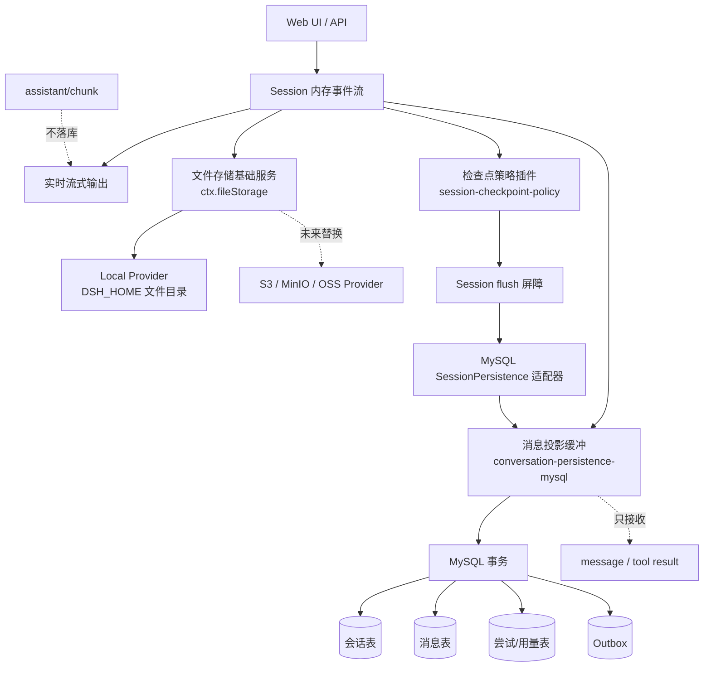

# 文件存储基础服务与检查点策略插件项目方案

## 1. 项目目标

本方案落地两部分能力：

1. **文件存储基础服务**：业务代码只依赖统一的文件对象接口，不直接依赖本地磁盘、S3、MinIO 或 OSS。
2. **检查点策略插件**：业务代码不再固定“每轮结束才持久化”或“每个事件都持久化”，第一阶段默认按照时间间隔触发，后续可扩展事件数量、混合策略和手动触发。

最终效果是：

- `assistant/chunk` 只留在内存和实时 UI 流中，不写入 MySQL；
- `user/message`、最终的 `assistant/message`、`tool/result` 才是 MySQL 的业务持久化对象；
- 文件原始字节与 MySQL 关系数据分离；
- 文件存储后端、会话持久化后端和检查点策略可以独立替换。

## 2. 当前代码基线

当前仓库已经具备一部分实现，方案以这些代码为基础继续演进：

| 模块 | 当前实现 | 本方案中的定位 |
|---|---|---|
| `@deepseek-ai/dsh-file-storage` | `ctx.fileStorage`，本地 SHA-256 内容寻址存储 | 文件存储基础服务，后续增加 S3/MinIO/OSS provider |
| `@deepseek-ai/dsh-conversation-persistence-mysql` | 保存会话、最终消息、工具结果、文件元数据 | 业务关系数据持久化；忽略 `assistant/chunk` |
| `@deepseek-ai/dsh-conversation-persistence-mysql/session-persistence` | 将 `SessionPersistence.append/flush` 适配为消息投影刷新 | 为现有 AgentLoop 提供兼容的持久化屏障 |
| `@deepseek-ai/dsh-session-checkpoint-policy` | 模型请求前、顶层工具执行前、步骤边界触发 `flush` | 默认增加按时间触发，并预留策略扩展点 |

因此，下一阶段不是重写所有持久化代码，而是补齐**策略调度、状态升级和存储 provider 替换能力**。

## 3. 总体架构



核心原则是：

- Session 是运行时上下文和实时事件来源；
- 检查点插件只负责“现在是否需要刷新”；
- 持久化插件负责“如何把已经形成的业务消息写入 MySQL”；
- 文件插件只负责“如何保存和读取文件字节”；
- MySQL 不保存文件 BLOB，也不保存逐 token chunk。

## 4. 文件存储基础服务

### 4.1 服务边界

服务名称：`file-storage`，提供 `ctx.fileStorage`。

业务层只依赖以下抽象：

```ts
interface FileObjectStore {
  readonly storageBackend: string

  put(data: Uint8Array, expectedSha256?: string): Promise<{
    sha256: string
    storageKey: string
    storageBackend: string
    byteSize: number
  }>

  get(storageKey: string, expectedSha256: string, signal?: AbortSignal): Promise<Buffer>
}
```

后续可以增加 `head`、`delete`、分片上传和生命周期接口，但不应让上层业务直接调用 `fs` 或 S3 SDK。

### 4.2 第一阶段本地实现

本地 provider 使用内容寻址：

```text
<DSH_HOME>/conversation-files/v1/objects/<sha256 前两位>/<完整 sha256>
```

写入流程：

1. 计算 SHA-256；
2. 校验调用方传入的摘要（如果有）；
3. 根据摘要生成固定 `storageKey`；
4. 先写临时文件，再原子 rename；
5. 相同摘要直接复用，天然去重；
6. 读取时重新计算摘要，发现文件被篡改就拒绝返回。

文件服务不保存用户权限，也不理解会话含义。它只负责可靠地保存和读取字节。

### 4.3 MySQL 中保存什么

MySQL 保存关系元数据，不保存文件原始字节：

```text
dsh_file_objects
  object_id
  sha256
  byte_size
  media_type
  storage_backend
  storage_key
  status

dsh_conversation_files
  file_id
  user_id
  session_id
  object_id
  original_name
  media_type
  byte_size
  purpose
  status

dsh_message_files
  session_id
  message_id
  file_id
  ordinal
  relation
```

其中：

- `dsh_file_objects` 描述“文件字节在哪里”；
- `dsh_conversation_files` 描述“哪个用户、哪个会话拥有这个文件”；
- `dsh_message_files` 描述“文件挂在哪条消息上”。

### 4.4 上传链路

```text
用户上传文件
  -> API 校验 userId、sessionId、大小、媒体类型
  -> ctx.fileStorage.put(bytes)
  -> 得到 sha256/storageKey/backend
  -> MySQL 事务写 file_objects + conversation_files
  -> 返回 fileId
```

文件先写对象存储，再写 MySQL 元数据。若 MySQL 事务失败，会产生一个暂时没有引用的对象；第一阶段记录日志并由后续清理任务回收，不能为了避免孤儿对象而把文件 BLOB 塞回 MySQL。

### 4.5 读取链路

```text
用户请求下载
  -> MySQL 按 userId + sessionId + fileId 校验归属
  -> 读取 object_id、storage_backend、storage_key、sha256
  -> ctx.fileStorage.get(storageKey, sha256)
  -> 校验摘要后返回字节流
```

所有读取都必须带用户和会话条件，不能只凭 `fileId` 读取，避免越权。

### 4.6 后续替换为 S3、MinIO 或 OSS

增加 provider，不修改消息表和业务 API：

```text
FileObjectStore
  ├── LocalFileObjectStore
  ├── S3FileObjectStore
  ├── MinioFileObjectStore
  └── OssFileObjectStore
```

配置只改变 provider 和连接参数：

```yaml
- id: file-storage
  name: '@deepseek-ai/dsh-file-storage'
  config:
    provider: local
    root: !!js dshHomePath('conversation-files/v1')
```

将来切换为 MinIO/S3 时，MySQL 的 `storage_backend` 和 `storage_key` 记录新 provider，`conversationPersistence` 不需要改写上传、下载和消息关联逻辑。

## 5. 检查点策略插件

### 5.1 为什么需要独立插件

“何时持久化”是运行策略，不应该写死在 MySQL 插件中。否则：

- JSONL、SQLite、MySQL 需要各自复制一套调度代码；
- 修改批量窗口必须修改存储实现；
- 无法针对不同部署配置不同的持久化频率；
- 测试无法将策略和数据库故障隔离。

检查点插件只做三件事：

1. 监听 Session 事件；
2. 统计自上次成功检查点以来的可持久化事件；
3. 根据策略调用统一的 `ctx.sessions.flush(session)`。

真正的写入仍由 `sessionPersistence` 和 `conversationPersistence` 完成。

### 5.2 事件分类：chunk 不参与持久化计数

由于目标是 message-only MySQL，策略不能把每个 token chunk 当成一次有效持久化事件：

| 事件 | 内存/UI | 检查点计数 | MySQL |
|---|---:|---:|---:|
| `user/message` | 是 | 是 | 是 |
| `assistant/chunk` | 是 | 否 | 否 |
| `assistant/message` | 是 | 是 | 是 |
| `tool/result` | 是 | 是 | 是 |
| `turn/end` | 是 | 强制触发 | 更新轮次状态 |
| `session/title` | 是 | 是 | 是 |

`assistant/chunk` 仍然存在于运行时 Session 中，供模型流式输出、UI 展示和最终消息组装使用；它不会进入 MySQL 消息表，也不会进入消息 spool。

### 5.3 策略接口与默认实现

```ts
type CheckpointReason =
  | 'event-count'
  | 'time'
  | 'turn-end'
  | 'model-boundary'
  | 'tool-boundary'
  | 'shutdown'
  | 'manual'

interface CheckpointInput {
  sessionId: string
  durableEventCount: number
  durableBytes: number
  elapsedMs: number
  lastEventType?: string
  reason: CheckpointReason
}

interface CheckpointPolicy {
  shouldCheckpoint(input: CheckpointInput): boolean
}
```

第一阶段提供一个默认实现：

```ts
class TimeCheckpointPolicy implements CheckpointPolicy {
  constructor(private readonly intervalMs: number) {}

  shouldCheckpoint(input: CheckpointInput): boolean {
    return input.elapsedMs >= this.intervalMs
  }
}
```

插件内部通过策略注册表选择实现，调度器只依赖 `CheckpointPolicy`，不依赖具体策略类：

```ts
interface CheckpointPolicyFactory {
  readonly type: string
  create(config: Record<string, unknown>): CheckpointPolicy
}
```

第一阶段配置默认使用 `time`：

```yaml
- id: session-checkpoints
  name: '@deepseek-ai/dsh-session-checkpoint-policy'
  config:
    strategy: time
    intervalMs: 3000
    forceAtTurnEnd: true
    forceAtShutdown: true
```

`intervalMs` 是第一阶段唯一的普通检查点触发参数，最终数值需要根据消息大小、并发量和 MySQL 写入耗时压测后调整。

后续新增策略只需要注册新的 factory，不需要修改 Session、MySQL 或文件存储代码，例如：

```text
time          按时间间隔触发（第一阶段默认）
event-count   按可持久化事件数量触发
hybrid        时间或事件数量任一达到即触发
manual        只接受显式调用
```

### 5.4 触发规则

#### 普通异步检查点（第一阶段：按时间）

- 距离上次成功检查点超过 `intervalMs` 时触发；
- 只有存在待持久化消息或状态变化时才真正执行 flush，避免空写入；
- 事件监听本身不阻塞模型流和 UI，刷新在后台执行。

事件数量策略暂不作为默认触发条件，但会保留 `durableEventCount` 统计字段，供后续 `event-count` 和 `hybrid` 策略直接复用。

#### 必须等待的语义检查点

以下位置仍然需要 `await ctx.sessions.flush(session)`：

- 下一次模型请求发出前；
- 顶层工具可能产生外部副作用前；
- `turn/end` 结束时；
- Session 关闭或进程退出前。

这部分是“顺序正确性屏障”，不能完全改成后台异步，否则可能出现模型已经看到下一轮请求、上一轮消息却还没有落库的情况。

### 5.5 同一会话的并发控制

每个 Session 维护一个轻量状态：

```text
pendingCount
pendingBytes
lastCheckpointAt
checkpointInFlight
dirty
lastError
```

规则：

- 同一 Session 同时只能有一个 checkpoint；
- checkpoint 执行期间到达的新事件标记为 `dirty`，不启动第二个并发写；
- 当前写入完成后，如果 `dirty` 且达到阈值，则立即补一次；
- 成功后清零计数；
- 失败后保留计数和内存消息，下一次显式 flush 或新事件到来时重试。

### 5.6 与 MySQL 消息持久化的配合

现有链路应保持为：

```text
session/event
  -> conversationPersistence 缓冲 user/message、assistant/message、tool/result
  -> checkpoint policy 判断是否 flush
  -> sessionPersistence-mysql.append/flush
  -> conversationPersistence.flushSession
  -> MySQL 单事务写入
       conversation revision
       message rows
       model attempt / usage
       outbox event
```

建议补齐以下两个行为：

1. **中间检查点可提交已经形成的最终消息**：即使轮次尚未收到 `turn/end`，已经产生的 `assistant/message` 和 `tool/result` 也可以写入；不能把尚未形成最终消息的 chunk 当成 assistant 内容写入。
2. **状态可升级且幂等**：同一 `messageId` 重试不能插入重复行；若先以 `partial` 写入，轮次正常结束后允许升级为 `completed`。当前按消息 ID 去重的逻辑需要增加这种状态升级路径。

MySQL 事务失败时继续使用 message-only spool 保存待写的最终消息、attempt 和失败原因；spool 不接受 `assistant/chunk`。

## 6. 失败与恢复方案

### 文件写入失败

- 摘要不匹配：立即拒绝；
- 文件过大或类型非法：API 层拒绝；
- 本地磁盘/S3 写入失败：不写 MySQL 元数据；
- MySQL 元数据失败：保留对象引用信息，后续清理无引用对象。

### 检查点失败

- 不丢弃内存中的待提交消息；
- 普通后台检查点记录失败并等待重试；
- 模型请求前、工具执行前、轮次结束时的强制检查点失败，则阻止后续动作并返回错误；
- MySQL 消息写入失败时进入已有 durable message spool。

## 7. 分阶段开发计划

### 阶段一：文件存储基础服务

- 固化 `FileObjectStore` 接口和 Cordis service；
- 完成本地内容寻址、原子写入、摘要校验和大小限制；
- MySQL 只保留对象元数据、文件归属和消息关联；
- 完成上传、下载、越权和重复文件测试。

### 阶段二：检查点策略插件

- 在现有 `session-checkpoint-policy` 上增加配置 schema；
- 首先实现 `time` 策略，并将其设为默认策略；
- 增加策略 factory/registry，确保后续可插入 event-count、hybrid、manual；
- 增加每 Session single-flight、dirty 合并和失败重试；
- 明确排除 `assistant/chunk` 的计数和落库。

### 阶段三：消息持久化一致性

- 为 `flushSession` 增加 checkpoint reason；
- 增加 `partial -> completed` 的幂等状态升级；
- 验证中间检查点不会把未完成 chunk 写入 MySQL；
- 验证 turn-end、shutdown 和异常中断场景。

### 阶段四：对象存储 provider

- 增加 S3/MinIO provider；
- 增加 provider 配置和连接健康检查；
- 支持从 local 迁移到对象存储而不改变消息表；
- 增加旧对象读取兼容和灰度切换。

### 阶段五：页面和 API 验收

- 会话列表只按当前用户查询；
- 消息正文从 MySQL 加载；
- 文件元数据和消息附件关系正确展示；
- 文件下载经过用户权限校验；
- 流式输出仍然实时显示，但刷新页面后只恢复最终消息，不恢复逐 token chunk。

## 8. 测试与验收标准

### 文件存储

- 相同内容只产生一个对象；
- 摘要错误和路径穿越被拒绝；
- 大文件限制生效；
- 文件字节损坏时读取失败；
- 不同用户不能读取彼此的文件元数据或字节。

### 检查点

- 达到事件数量阈值会触发一次刷新；
- 超过时间阈值会触发一次刷新；
- chunk 数量增加不会触发 MySQL 消息写入；
- 同一 Session 的并发刷新不会重复写入；
- MySQL 暂时不可用时消息保留在 spool 并可重试；
- turn-end 和 shutdown 一定执行最终刷新；
- 刷新失败时不会提前执行下一次有副作用的工具调用。

### 数据结果

- MySQL 没有 `assistant/chunk` 行；
- 每条最终消息以 `messageId` 幂等；
- 文件对象、会话文件和消息附件关系可完整回查；
- 从 MySQL 恢复出的会话能够继续对话，但不承诺逐 token 历史重放。

## 9. 本阶段结论

第一阶段建议保持当前插件拆分：

```text
file-storage                         文件字节
conversation-persistence-mysql       会话/消息/文件元数据
session-persistence-mysql            兼容 SessionPersistence 接口
session-checkpoint-policy             决定何时 flush
```

先完成本地文件存储和“按时间触发”的检查点策略，再进行 S3/MinIO provider 扩展。策略通过 factory/registry 保持可扩展，不直接绑定 MySQL；MySQL 也不保存 chunk。这样既满足当前 ToC 会话产品的恢复需求，也为后续增加事件数量或混合策略留下清晰边界。

## 10. 当前实现状态（2026-08-21）

本方案中已经落地的部分如下：

| 能力 | 当前状态 | 代码与验证 |
|---|---|---|
| 独立文件存储服务 | 已完成。`ctx.fileStorage` 使用本地 SHA-256 内容寻址、摘要校验、原子写入和内容去重；MySQL 只保存对象与归属元数据。 | [`packages/storage/file-storage`](../../packages/storage/file-storage)、5 个文件存储测试通过 |
| message-only 会话持久化 | 已完成当前阶段。`user/message`、最终 `assistant/message`、`tool/result` 和文件关联写入 MySQL；`assistant/chunk` 不写消息表。 | [`packages/session/conversation-persistence-mysql`](../../packages/session/conversation-persistence-mysql)、相关类型检查通过 |
| Session 持久化兼容层 | 已完成当前阶段。通过 `session-persistence-mysql` 将 AgentLoop 的 `SessionPersistence` 屏障适配到消息投影刷新。 | [`packages/session/session-persistence-mysql`](../../packages/session/session-persistence-mysql) |
| 检查点策略插件 | 已完成当前阶段。默认 `time` 策略间隔 3 秒，支持策略注册表；模型请求、顶层工具、步骤和关闭边界仍是强制屏障；chunk 不参与时间检查点。 | [`packages/session/session-checkpoint-policy`](../../packages/session/session-checkpoint-policy)、13 个插件测试通过 |

本次验证使用项目要求的 Node 22+ 运行时：相关 8 个测试文件共 167 个测试通过，根项目 `typecheck` 通过，`git diff --check` 通过。

以下项目仍属于后续阶段，不应在产品文档中表述为已经交付：

- Redis read-through 缓存、跨实例动态配置失效和 CDC/Kafka/Elasticsearch 下游链路；
- 管理员配置页面和管理 API；
- S3/MinIO/OSS 文件 provider 及 local 到对象存储的迁移；
- `partial -> completed` 的完整消息状态升级与真实断电恢复验收；
- 真实 MySQL 环境下的集成测试。当前测试在未设置 `DSH_MYSQL_TEST_URL` 时会跳过真实数据库用例。
