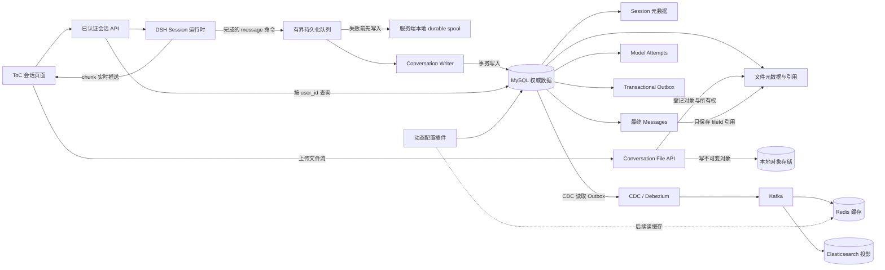
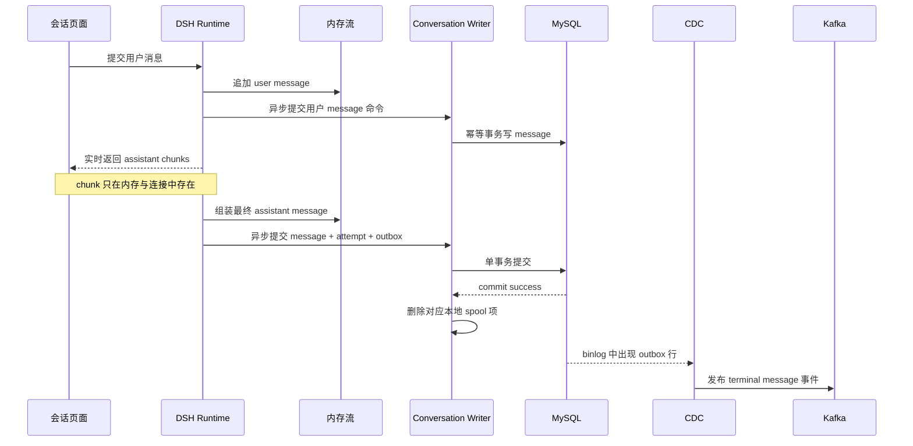

# ToC DSH：Message-only 会话存储修订方案

> 状态：阶段 A-D 已完成首版实现；阶段 E 已提供可选 Outbox fan-out 适配器（CDC/Debezium 连接器仍作为部署侧组件接入）。当前代码与相关测试已验证；Redis 缓存、管理配置页和真实 MySQL 集成验收仍未完成。基准日期：2026-08-20。依据：`项目基建开发讨论纪要.docx`、本机 `dsh_test` 实际 DDL、当前 MySQL 插件代码及 `docs/multi-user` 约束。

## 1. 最终结论

本轮方案从“完整 Session 事件日志落 MySQL”调整为“业务会话消息落 MySQL”：

- `assistant/chunk` 只用于生成期间的内存组装和页面流式显示，不写 MySQL，不进入 Kafka，不进入 Elasticsearch，也不作为历史恢复依据。
- MySQL 是会话关系和语义数据的唯一权威存储，保存 Session 元数据、最终 message、文件引用、工具结果、模型 attempt、usage 和事务 Outbox；内容寻址对象存储是文件字节的权威来源。
- 对话文件采用“文件字节与关系元数据分离”：MySQL 保存文件元数据、用户/Session 所有权和 message 引用，文件原始字节保存到内容寻址对象存储。第一阶段复用本地 `DSH_HOME` 文件后端，后续可以替换为 S3/MinIO，而不修改 message 数据模型。
- Redis 只做热点缓存、动态配置缓存以及未来可选的短时断线重连状态，不作为消息权威存储，也不采用 `Redis -> MySQL` 作为正常写入主路径。
- Kafka、Redis、Elasticsearch 都消费 MySQL 提交后的变化；任一下游失败都不能改变 MySQL 中的会话事实。
- 采用新的 Conversation Persistence 插件，不在现有 `SessionPersistence` 插件内直接过滤 chunk。现有插件要求完整、连续、可回放的事件日志，直接删 chunk 会破坏 `seq` 和 `sourceEventSeqs` 契约。
- 当前 ToC 第一版继续使用“Session 直接归属 User”的数据库模型，不重新引入 Tenant。所有查询必须使用可信认证上下文中的 `user_id` 做范围限定。组织租户属于后续 schema 大版本升级。

### 1.1 本阶段交付范围

当前开发不同时铺开所有中间件，第一阶段只交付：

1. MySQL 中的用户会话列表、最终 message、工具结果和模型 attempt；
2. 对话图片及普通文件的对象存储、MySQL 元数据、message 引用和用户隔离；
3. 标题状态机、会话列表标题列、LLM 自动标题和用户手工改名；
4. conversations/messages/attempts/files/config 等表的受控 JSON 扩展字段；
5. MySQL 动态配置插件及短时进程内缓存；
6. 从 MySQL 恢复当前用户会话和文件引用；
7. 旧事件日志到 message-only 表的迁移能力。

Redis、CDC、Kafka、Elasticsearch 暂不作为第一阶段运行依赖。Outbox 可以先建表并与业务事务一起写入，但在 CDC 接入前不要求启动发布链路。

## 2. 会议建议如何落到方案中

### 2.1 采纳的建议

1. **Session 增加可直接查询的标题。** 会话列表是高频查询，`title` 必须是独立列，不能只藏在事件 payload 或 JSON 扩展字段中。
2. **增加 JSON 扩展能力。** 低频、非筛选、非权限类属性放入 `extensions`，避免每个实验属性都修改表结构。
3. **默认值改为动态配置。** 标题占位文案、标题长度、是否启用 LLM 标题、单条消息大小上限等通过配置插件读取，避免散落在函数中的硬编码。
4. **先完成 MySQL，再接 Redis/CDC。** MySQL message 写入、读取、用户隔离和迁移先闭环；Redis 缓存、CDC、Kafka 路由、ES 索引分阶段接入。
5. **Kafka 事件协议带版本和扩展字段。** 协议固定核心身份字段，允许在 `extensions` 中增加非关键属性。
6. **异步写入不阻塞下一轮交互。** 运行时上下文继续在内存可用，后台持久化采用有界队列和幂等写入。
7. **MySQL 写入失败时保留本地兜底。** 采用服务端本地 durable spool/WAL 保存“已组装的 message 写命令”，而不是保存每一个 chunk。

### 2.2 修正或限制的建议

- **不把 Redis 放在 MySQL 前面作为消息主存。** 如果 Redis 过期、被淘汰或重启，而异步写 MySQL 又失败，用户会话会永久丢失。Redis 只在 MySQL 提交之后缓存或失效。
- **不采用“4 个数据库有一个成功就算成功”。** MySQL 提交成功才代表业务持久化成功；Redis、Kafka、ES、磁盘副本不能各自成为真源。
- **不把业务写失败任务存在同一个尚不可用的 MySQL 中。** MySQL 本身不可用时，任务表也写不进去。因此 App -> MySQL 失败由本地 durable spool 兜底；MySQL -> Kafka 的一致性才由事务 Outbox 解决。
- **不把整个用户轮次强行放进一个超大事务。** 用户消息、每个完成的 assistant step、每个 tool result 都是语义检查点。这样 AI 失败时用户输入仍然存在，工具链很长时也不会形成超大事务。
- **不把 `title`、所有权、状态、版本等关键字段放入 JSON。** 这些字段需要过滤、排序、约束或并发控制，必须是普通列。

## 3. 当前数据库字段同步结果

以下内容来自正在运行的 Docker MySQL 容器，而不是旧文档推断。

### 3.1 当前版本与数据量

| 项目 | 当前值 |
| --- | ---: |
| User schema version | 2 |
| Conversation schema version | 3 |
| `dsh_users` | 5 行 |
| `dsh_conversations` | 0 行 |
| `dsh_conversation_messages` | 0 行 |

当前库只保留 message-only 表；旧事件日志表及其 chunk 数据已经移除。新对话完成后，MySQL 只增加最终 message、attempt 和语义 Outbox 行。

### 3.2 `dsh_users`：实际字段

| 字段 | 含义 | 约束 |
| --- | --- | --- |
| `user_id` | 用户稳定主键 | PK，ASCII |
| `display_name` | 展示名称 | 可空 |
| `status` | 生命周期状态 | `active/disabled/deleted` |
| `created_at` | 创建时间 | 毫秒时间戳 |
| `updated_at` | 更新时间 | 毫秒时间戳 |
| `revision` | 乐观并发版本 | 默认 0 |

该表已经没有 `tenant_id`，当前用户目录代码 schema 与真实数据库一致。

### 3.3 `dsh_conversations`：实际字段

| 字段组 | 当前字段 |
| --- | --- |
| 身份 | `session_id`、`user_id` |
| DSH header | `version`、`cwd`、`parent_session_id`、`seed_length`、`origin`、`delegation_depth`、`agent_preset` |
| 标题 | `title`、`title_status`、`title_source`、`title_revision`、`title_updated_at` |
| 并发/排序 | `incarnation`、`revision`、`next_message_ordinal` |
| 状态/扩展 | `status`、`extensions` |
| 时间 | `created_at`、`updated_at` |

当前约束为：

- `user_id -> dsh_users.user_id`；
- 父 Session 外键指回当前 Session 表；
- 用户列表索引为 `(user_id, status, updated_at, session_id)`。

会话表直接保存用户归属，不使用 `owner_kind/owner_id` 多态所有者字段。

### 3.4 `dsh_conversation_messages`：实际字段

| 字段组 | 当前字段 |
| --- | --- |
| 身份与归属 | `message_id`、`session_id`、`user_id` |
| 顺序 | `ordinal` |
| 语义 | `event_type`、`role`、`turn_no`、`step_no` |
| 内容 | `content_json`、`source_json`、`tool_call_id`、`usage_json` |
| 状态 | `visibility`、`status`、`extensions` |
| 时间 | `created_at`、`updated_at` |

消息直接保存 `user_id`，查询可以使用 `(user_id, session_id, ordinal)` 索引；`(session_id, user_id)` 联合外键保证消息用户与会话用户一致，避免冗余字段发生权限错配。

### 3.5 数据库与代码的同步结论

真实 DDL 与以下代码保持一致：

- `packages/identity/user-mysql/src/schema.ts`：User schema v2；
- `packages/session/conversation-persistence-mysql/src/schema.ts`：Conversation schema v3；
- 两处都明确拒绝带旧 `tenant_id` 的未迁移表。

因此后续设计必须以“直接 User 所有权”为当前基线，不能继续沿用旧的 Tenant 字段方案。

## 4. 目标数据边界

### 4.1 哪些内容进入 MySQL

| 数据 | 是否持久化 | 存储位置 |
| --- | --- | --- |
| 人类用户消息 | 是 | `dsh_conversation_messages` |
| 需要参与恢复的插件注入消息 | 是，但 UI 默认隐藏 | `dsh_conversation_messages` |
| 最终 assistant message | 是 | `dsh_conversation_messages` |
| assistant 中最终 tool-call block | 是 | assistant message 的 `content_json` |
| tool result | 是 | 独立 message 行，并保存 `tool_call_id` |
| usage | 是 | assistant message 和 model attempt |
| provider/model/首 token/结束原因/错误 | 是 | `dsh_model_attempts` |
| Session 标题和列表元数据 | 是 | `dsh_conversations` |
| 文件逻辑元数据与所有权 | 是 | `dsh_conversation_files` |
| message 与文件引用关系 | 是 | `dsh_message_files` |
| 文件摘要、大小和物理对象状态 | 是 | `dsh_file_objects` |
| 图片、文档等原始字节 | 是，但不放 MySQL | 本地内容寻址对象目录；后续 S3/MinIO |
| 最后一次必要的运行配置快照 | 是 | Session 扩展或专用快照字段；不能依赖 chunk |
| `assistant/chunk` | 否 | 仅内存；未来可选 Redis 短 TTL |
| token 级回放边界 | 否 | 第一版不承诺 |
| Kafka/ES 投影 | 可重建 | 下游，不是真源 |

### 4.2 Message 与 chunk 的关系

一个模型回答可能产生 200 个 `assistant/chunk`，但最终只形成一条 `assistant/message`：

```text
chunk 1: "你"
chunk 2: "好"
chunk 3: "，"
...
chunk 200: finish + usage

最终 message:
{
  role: "assistant",
  content: [{ type: "text", text: "你好，……" }],
  usage: { ... }
}
```

MySQL 只保存最后的 message 和 usage。恢复历史时使用最终 message，不再重建原来的 200 个 chunk，也不再保留它们原来的 `seq`。

文件也遵守相同原则：message 的 `content_json` 只保存稳定 `fileId/attachmentId` 和展示元数据，不保存浏览器路径、`blob:` URL、base64、大段二进制或对象存储签名 URL。

## 5. 目标架构



架构中只有一条业务写成功路径：`Writer -> MySQL`。本地 spool 是写入失败前的恢复介质，Outbox 是 MySQL 已提交事实向 Kafka 传播的桥梁，二者解决的是不同问题。

文件写入有两个受控步骤：先让不可变对象字节达到 durable 状态，再用 MySQL 事务发布逻辑文件和 message 引用。文件对象写成功但 MySQL 事务失败时，该对象暂时是不可达 orphan，由延迟垃圾回收清理；绝不能反过来先提交一个指向不存在字节的 message。

## 6. 插件拆分

### 6.1 保留现有插件

- `@deepseek-ai/dsh-mysql`：继续提供 Host-only 连接池和事务能力。
- `@deepseek-ai/dsh-user`：继续定义用户领域接口。
- `@deepseek-ai/dsh-user-mysql`：继续拥有 `dsh_users`。
- `@deepseek-ai/dsh-session-persistence-mysql`：迁移期间只负责读取旧完整事件日志，不再作为 message-only 新写入方案。

### 6.2 新增插件

建议新增 `@deepseek-ai/dsh-conversation-persistence-mysql`，拥有：

- Conversation schema；
- message/attempt/outbox 事务写入；
- 按当前用户 list/get/readMessages；
- 幂等写入；
- 从 message rows 恢复内存 Session 的 Hydrator；
- 旧事件日志到 message 模型的一次性迁移器。

不要让新旧两个持久化插件同时写同一个 Session。迁移期可以“旧读 + 新表回填”，切换后只允许新插件写入。

建议另建 `@deepseek-ai/dsh-runtime-config-mysql`：

- 第一阶段直接从 MySQL 读取，并带短时进程内缓存；
- 第二阶段接 Redis read-through 缓存；
- 配置更新以 `revision` 做乐观并发；
- 对调用方暴露有类型的 `get(key)`，而不是让业务插件直接查配置表。

该插件属于第一阶段必做项，不再后置到 Redis 阶段。Redis 未接入前使用带 TTL/revision 的进程内缓存；管理员或内部 API 更新配置成功后，当前进程立即失效对应 key。多实例失效等 CDC 或 Redis 接入后再补齐。

当前 `SessionTitleService` 的 `fallbackMaxWords`、`fallbackMaxBytes` 和 `maxTitleBytes` 是构造期必填配置。接入动态配置时不要在运行中直接修改其私有 config；应增加一个窄的 `SessionTitlePolicyResolver`/配置桥接 seam，在每次创建 fallback 或启动 provider 任务前读取一份不可变策略快照。构造配置继续作为 bootstrap fallback 和启动校验值。

### 6.3 文件存储相关插件

现有代码已经提供：

- `@deepseek-ai/dsh-attachment`：不可变图片引用和 `ctx.attachments` seam；
- `@deepseek-ai/dsh-attachment-local`：将图片保存到 `<DSH_HOME>/attachments/v1/objects/<prefix>/<sha256>`；
- `@deepseek-ai/dsh-spill` / `dsh-spill-local`：保存过大的工具文本，但当前定位符是本机路径，且没有引用感知的删除能力。

第一阶段不推倒重写现有图片后端，建议增加 `@deepseek-ai/dsh-conversation-file-mysql`：

- 依赖 `ctx.mysql` 和底层 attachment/object store；
- 拥有文件对象、逻辑文件和 message-file 引用表；
- 对外提供按认证用户和 Session 范围的 create/read/link/unlink；
- 图片继续复用现有校验、摘要和原子发布实现；
- 普通文件扩展新的 `FileAttachmentRef`，但沿用相同的不可变对象 id；
- 未来把本地对象后端替换为 S3/MinIO 时，MySQL 表和 Conversation API 不变。

工具工作目录中的文件不会自动变成永久对话附件。只有用户上传，或者工具/assistant 显式“发布为对话文件”时，系统才把该文件复制进不可变对象存储并创建 MySQL 引用。Workspace 属于执行环境，Conversation File 属于用户可长期访问的业务数据，两者不能混为一类。

## 7. 推荐的新表设计

新表与旧事件表并存完成迁移，避免直接改坏已经能工作的 v3 事件日志。

### 7.1 `dsh_conversations`

| 字段 | 类型建议 | 说明 |
| --- | --- | --- |
| `session_id` | `VARCHAR(256)` | PK，沿用当前 SessionId |
| `version` | `INT UNSIGNED` | 沿用 Session header 版本 |
| `user_id` | `VARCHAR(128)` | FK -> `dsh_users.user_id` |
| `title` | `VARCHAR(256)` | 会话列表直接展示 |
| `title_status` | `VARCHAR(16)` | `fallback/generating/generated/manual` |
| `title_source` | `VARCHAR(32)` | `config/first_message/model/user` |
| `title_revision` | `BIGINT UNSIGNED` | 只控制标题异步竞争，不受普通 message 写入影响 |
| `title_updated_at` | `BIGINT UNSIGNED` | 标题最后更新时间 |
| `status` | `VARCHAR(16)` | `active/archived/deleted` |
| `cwd` | `TEXT` | 沿用当前字段；服务端模式后续改为 workspace id |
| `parent_session_id` | `VARCHAR(256)` | 沿用父 Session 关系 |
| `seed_length` | `BIGINT UNSIGNED` | 沿用当前字段 |
| `origin` | `VARCHAR(32)` | 沿用当前字段 |
| `delegation_depth` | `INT UNSIGNED` | 沿用当前字段 |
| `agent_preset` | `VARCHAR(256)` | 沿用当前字段 |
| `incarnation` | `CHAR(36)` | 保留运行实例身份 |
| `revision` | `BIGINT UNSIGNED` | 乐观并发版本 |
| `next_message_ordinal` | `BIGINT UNSIGNED` | 只对 message 排序，不再代表事件 seq |
| `extensions` | `JSON` | 低频扩展信息 |
| `created_at` | `BIGINT UNSIGNED` | 毫秒时间戳 |
| `updated_at` | `BIGINT UNSIGNED` | 会话列表排序 |

推荐索引：

```text
PRIMARY KEY (session_id)
INDEX conversations_user_list (user_id, status, updated_at, session_id)
INDEX conversations_parent (parent_session_id)
```

### 7.2 `dsh_conversation_messages`

| 字段 | 类型建议 | 说明 |
| --- | --- | --- |
| `message_id` | `VARCHAR(128)` | 全局稳定消息 id，PK |
| `session_id` | `VARCHAR(256)` | FK -> conversation |
| `user_id` | `VARCHAR(128)` | 直接用户归属；与 `session_id` 组成联合 FK |
| `ordinal` | `BIGINT UNSIGNED` | Session 内语义顺序 |
| `event_type` | `VARCHAR(32)` | `user/message`、`assistant/message`、`tool/result` |
| `role` | `VARCHAR(16)` | `user/assistant/tool` |
| `turn_no` | `INT UNSIGNED` | DSH turn |
| `step_no` | `INT UNSIGNED` | DSH step |
| `content_json` | `JSON` | DSH message content blocks |
| `source_json` | `JSON` | human/plugin/model 来源，不含认证凭据 |
| `tool_call_id` | `VARCHAR(128)` | tool result 对应调用，可空 |
| `usage_json` | `JSON` | assistant usage，可空 |
| `visibility` | `VARCHAR(16)` | `user/internal`，页面默认只展示 user |
| `status` | `VARCHAR(16)` | `completed/partial/failed/superseded` |
| `extensions` | `JSON` | UI 卡片等低频扩展信息 |
| `created_at` | `BIGINT UNSIGNED` | 创建时间 |
| `updated_at` | `BIGINT UNSIGNED` | 更新 partial/manual repair 时使用 |

推荐约束与索引：

```text
UNIQUE (session_id, ordinal)
INDEX messages_session_order (session_id, ordinal)
INDEX messages_user_session_order (user_id, session_id, ordinal)
INDEX messages_tool_call (session_id, tool_call_id)
```

`assistant/message` 的 `content_json` 保存最终 `tool-call` block；`tool/result` 再单独保存结果行。这样恢复模型历史时可以还原“模型提出工具调用 -> 工具返回结果”的完整语义。

### 7.3 `dsh_model_attempts`

该表不是 chunk 表，而是一次模型请求的状态摘要。

| 字段组 | 推荐字段 |
| --- | --- |
| 身份与归属 | `attempt_id`、`session_id`、`user_id`、`turn_no`、`step_no`、`retry_no` |
| 模型 | `provider`、`model` |
| 状态 | `status`：`started/completed/failed/cancelled` |
| 时间 | `started_at`、`first_token_at`、`finished_at` |
| 结果 | `finish_reason`、`usage_json`、`final_message_id` |
| 异常 | `error_code`、`error_message`、可选 `partial_content_json` |
| 扩展 | `extensions` |

成功 attempt 不保存 chunk。只有产品明确承诺“中断后恢复半条回答”时，失败 attempt 才允许保存有大小上限的 `partial_content_json`。

### 7.4 `dsh_conversation_outbox`

Outbox 与 message/attempt 在同一个 MySQL 事务提交，用于 CDC/Kafka，不用于保存 chunk。

| 字段 | 说明 |
| --- | --- |
| `outbox_id` | 全局事件 id，PK |
| `schema_version` | Kafka 语义协议版本 |
| `event_type` | 例如 `conversation.message.committed` |
| `aggregate_type`、`aggregate_id` | 聚合身份 |
| `user_id` | 当前用户范围 |
| `session_id`、`message_id` | 路由和幂等身份 |
| `aggregate_revision` | 顺序与去重辅助 |
| `payload_json` | 稳定核心载荷 |
| `extensions` | 协议扩展字段 |
| `occurred_at` | 业务提交时间 |

如果 Debezium 直接读取 Outbox，就不需要应用在事务外再发一次 Kafka，从而避免“数据库成功但 Kafka 发送失败”的双写问题。

### 7.5 `dsh_runtime_configs`

| 字段 | 说明 |
| --- | --- |
| `config_key` | 点分路径，如 `conversation.default_title`，PK |
| `value_json` | 配置值 |
| `value_type` | string/number/boolean/json |
| `schema_version` | 当前配置值的校验 schema 版本 |
| `description` | 管理端说明 |
| `status` | active/disabled |
| `revision` | 乐观并发版本 |
| `updated_by` | 修改人；本地阶段可为空 |
| `extensions` | 非关键扩展信息 |
| `created_at`、`updated_at` | 时间 |

第一批配置建议：

```text
conversation.default_title
conversation.title.max_length
conversation.title.llm_enabled
persistence.max_message_bytes
persistence.queue_capacity
persistence.spool_retention_hours
persistence.retry_base_delay_ms
file.max_bytes
file.max_files_per_message
file.allowed_media_types
file.orphan_grace_hours
```

业务代码仍应保留安全的 bootstrap fallback，防止配置表首次初始化失败；正常运行值以配置插件为准。

动态配置插件必须具备以下行为：

1. 每个 namespace 先注册类型 schema、bootstrap 默认值和是否允许动态修改；
2. `get(key)` 返回已校验值、来源和 revision；
3. `update(key, value, expectedRevision)` 在 MySQL 事务内进行乐观并发更新；
4. 类型不匹配、未知 key、禁用配置和超出限制的值在进入业务代码前被拒绝；
5. MySQL 暂时不可用时，已有已校验缓存可以在明确 TTL 内继续读；没有缓存时使用代码中的安全 bootstrap 值并记录降级状态；
6. 配置修改影响后续操作，不追溯改写已有标题、消息或文件记录。

### 7.5.1 JSON 扩展字段统一约束

`extensions` 是受控扩展面，不是无结构垃圾桶。第一阶段在 conversations、messages、attempts、files、file objects、outbox 和 runtime configs 中统一采用 MySQL `JSON` 类型，并遵守：

- 应用写入时始终提供 JSON object；空值写 `{}`，不写 JSON 字符串；
- key 使用插件/领域 namespace，例如 `title.model`、`file.image`，避免不同插件互相覆盖；
- 单行扩展字段默认限制为 32 KiB，超限必须拆成正式表或对象文件；
- 所有权、权限、状态、标题、排序、幂等键、外键、时间和常用筛选字段禁止只放在 extensions；
- 扩展更新携带所属记录 revision，并使用 merge-patch 或明确路径更新，不能用陈旧页面整对象覆盖；
- API 只返回调用方有权看到的扩展 namespace，不能把内部 storage key、错误堆栈或 secret 放进去；
- 某个扩展字段一旦用于查询、索引、约束或跨插件协议，就提升为正式列并通过 schema migration 管理。

### 7.6 `dsh_file_objects`

该表描述不可变物理对象。文件字节本身不进入 MySQL。

| 字段 | 类型建议 | 说明 |
| --- | --- | --- |
| `object_id` | `VARCHAR(80)` | PK，例如 `sha256:<64 hex>` |
| `sha256` | `BINARY(32)` | 内容完整性校验 |
| `byte_size` | `BIGINT UNSIGNED` | 精确字节数 |
| `media_type` | `VARCHAR(128)` | 服务端探测或校验后的类型 |
| `storage_backend` | `VARCHAR(32)` | 第一阶段为 `local-v1` |
| `storage_key` | `VARCHAR(512)` | 后端内部 key，不是用户路径或 bearer URL |
| `status` | `VARCHAR(16)` | `staging/ready/corrupt/deleting` |
| `created_at` | `BIGINT UNSIGNED` | 创建时间 |
| `verified_at` | `BIGINT UNSIGNED` | 最近完整性校验时间，可空 |
| `extensions` | `JSON` | 图片宽高、编码等类型特有元数据 |

同一内容可以物理去重，但 `object_id` 或摘要本身不能授权读取。知道 SHA-256 不等于拥有该文件。

### 7.7 `dsh_conversation_files`

该表表示归属于某个用户和 Session 的逻辑文件。

| 字段 | 类型建议 | 说明 |
| --- | --- | --- |
| `file_id` | `VARCHAR(128)` | 业务不透明 id，PK；不要直接把摘要当公开 id |
| `user_id` | `VARCHAR(128)` | FK -> `dsh_users.user_id` |
| `session_id` | `VARCHAR(256)` | FK -> `dsh_conversations.session_id` |
| `object_id` | `VARCHAR(80)` | FK -> `dsh_file_objects.object_id` |
| `original_name` | `VARCHAR(255)` | 仅保留净化后的叶子文件名 |
| `media_type` | `VARCHAR(128)` | 供页面展示和下载响应使用 |
| `byte_size` | `BIGINT UNSIGNED` | 冗余快照，读取时可与对象校验 |
| `purpose` | `VARCHAR(32)` | `user_upload/assistant_output/tool_output/spill` |
| `status` | `VARCHAR(16)` | `ready/deleted/quarantined` |
| `created_at` | `BIGINT UNSIGNED` | 创建时间 |
| `deleted_at` | `BIGINT UNSIGNED` | 软删除时间，可空 |
| `extensions` | `JSON` | 图片宽高、解析状态等非关键属性 |

推荐索引：

```text
INDEX files_user_session (user_id, session_id, status, created_at, file_id)
INDEX files_object (object_id)
```

数据库和业务层都要验证 `dsh_conversation_files.user_id` 与所属 conversation 的 `user_id` 一致，不能建立跨用户 Session 文件引用。

### 7.8 `dsh_message_files`

该表建立最终 message 与逻辑文件的多对多引用。

| 字段 | 说明 |
| --- | --- |
| `session_id`、`message_id` | 所属 message |
| `file_id` | 所属逻辑文件 |
| `ordinal` | 文件在 message 中的顺序 |
| `relation` | `input/output/inline/tool-result` |
| `created_at` | 引用创建时间 |

推荐主键为 `(session_id, message_id, file_id)`，并增加 `(session_id, message_id, ordinal)` 唯一约束。写 message 时，message row、所有 `dsh_message_files` 和 conversation 的 `updated_at/revision` 必须在同一个 MySQL 事务中提交。

对于图片，`content_json` 中仍可保存现有 `ImageAttachmentRef` 的展示信息；MySQL 引用表负责授权和生命周期。对于普通文件，建议新增：

```json
{
  "type": "file",
  "file": {
    "fileId": "file_...",
    "name": "report.pdf",
    "mediaType": "application/pdf",
    "bytes": 123456
  }
}
```

该结构不能包含客户端绝对路径、服务器物理路径、临时上传路径或长期有效的下载 URL。

## 8. 写入流程



### 8.1 持久化检查点

采用以下语义检查点，而不是“每 200 ms 保存 chunk”：

1. **用户消息被系统接受后**：立即排队保存。即使模型失败，用户输入仍可在历史中看到。
2. **每个 assistant step 完成后**：保存组装后的 assistant message、usage 和 attempt 完成状态。
3. **每个 tool result 完成后**：保存 tool result message。
4. **失败或取消时**：关闭 attempt；只有开启 partial 恢复时才保存有界 partial message。
5. **标题变化时**：单独更新 conversation 标题，不重写历史消息。

每个写命令携带稳定 `operation_id` 或业务唯一键。重试时使用 `INSERT ... ON DUPLICATE KEY` 或唯一约束判定已提交，避免重复 message。

### 8.2 异步不等于不可靠

运行时不用等待远程 MySQL commit 才能进入下一轮，但必须区分三个状态：

- `pending`：message 已在内存并进入持久化队列；
- `saved`：MySQL 已提交；
- `save_failed`：重试预算耗尽，仍保留在本地 spool，并在页面提示未同步。

同一进程中读取会话时，页面可以把“已从 MySQL 读取的数据”和“当前用户尚未提交的 pending message”合并显示；提交成功后移除 overlay。

### 8.3 本地 durable spool 的边界

Spool 保存的是完整的 message 写命令，例如一条最终 assistant message，而不是 200 个 chunk。推荐采用：

- append-only JSONL 或长度前缀二进制记录；
- 每条记录带 checksum、operation id、user id、session id 和创建时间；
- MySQL 成功后写完成标记并定期压缩；
- 只保存在服务端实例受控目录，不能使用用户提交路径；
- 设置最大容量和保留时间，容量满时显式拒绝继续承诺持久化，不能静默丢弃；
- 后续多实例部署时替换为受管理的持久队列，不依赖临时容器磁盘。

第一阶段不实现“死信广播到 MySQL、Redis、ES、磁盘，任一成功即成功”，也不实现复杂对账平台。

### 8.4 对话文件写入流程

#### 用户上传

1. API 从认证上下文取得 `user_id`，按 `(user_id, session_id)` 验证用户拥有该会话。
2. 服务端校验文件数量、大小、扩展名、实际媒体类型和净化后的展示名。普通文件使用流式 multipart/chunked 上传，不能继续用整文件 base64 占用内存。
3. 字节先进入私有 staging 文件，写入时同步计算 SHA-256；完成后校验大小和摘要。
4. 使用现有 attachment-local 的思路，把 staging 文件原子发布到内容寻址对象目录；发布路径由摘要计算，永远不使用用户文件名拼路径。
5. 在 MySQL 事务中幂等登记 `dsh_file_objects` 和 `dsh_conversation_files`，返回业务 `file_id`。
6. 用户真正发送消息时，在一个事务中写 message 和 `dsh_message_files` 引用。未发送的草稿文件暂不进入 message 历史，可以按短保留期清理。

#### Assistant/工具生成文件

1. 工具在 Session workspace 中生成文件；此时它仍只是执行环境文件。
2. 只有工具返回结构化 file output，或用户点击“保存到对话”时，Host 才读取并校验该文件。
3. Host 将字节复制进不可变对象存储，并以 `purpose = tool_output/assistant_output` 创建逻辑文件。
4. tool result 或 assistant message 只保存 `file_id` 引用。之后 sandbox 被销毁也不影响用户下载。

不要把工具返回的任意 Host 绝对路径直接放进持久 message。当前 `spill-local` 的本机路径模式只适用于可信本地 profile；ToC 服务端需要把需要长期访问的 spill 重新发布为受授权的 Conversation File。

### 8.5 文件读取、删除与垃圾回收

读取或下载文件必须执行以下联表授权：

```sql
SELECT f.file_id, f.object_id, f.original_name, f.media_type, f.byte_size,
       o.storage_backend, o.storage_key
FROM dsh_conversation_files AS f
JOIN dsh_conversations AS c ON c.session_id = f.session_id
JOIN dsh_file_objects AS o ON o.object_id = f.object_id
WHERE f.file_id = :file_id
  AND f.session_id = :session_id
  AND f.user_id = :authenticated_user_id
  AND c.user_id = :authenticated_user_id
  AND f.status = 'ready'
  AND o.status = 'ready';
```

授权成功后，由 Host 读取对象并以流式响应返回；不得向浏览器返回本地 `storage_key`。切换到对象存储后可以返回短期、单对象、只读的签名 URL，但 URL 本身不能持久化进 message。

删除遵守“先断引用，后删对象”：

1. 在 MySQL 中软删除逻辑文件或删除 message-file 引用；
2. 只有对象不存在任何有效引用，且超过 orphan/retention 宽限期后，后台任务才删除物理对象；
3. fork 可以复用不可变对象，但必须给新 Session 建立自己的引用；
4. 相同字节即使物理去重，也按每个用户的逻辑文件计算配额，避免通过去重行为泄露其他用户是否拥有相同文件；
5. 物理对象缺失或摘要不匹配时将对象标记为 `corrupt`，不能继续返回未校验字节。

## 9. 标题生成与动态配置流程

现有 `@deepseek-ai/dsh-session-title` 已实现确定性 fallback、异步 provider 标题、用户 rename 钉住和陈旧任务取消。第一阶段应复用该领域服务，把其已接受结果投影到 `dsh_conversations`，而不是重写标题生成算法。

MySQL 状态机如下：

```text
创建 Session
  -> fallback(config)                 title_status=fallback

首条有效人类消息
  -> fallback(first_message)          title_status=fallback
  -> 领取 LLM 生成任务                 title_status=generating

LLM 成功且 title_revision 未变化
  -> generated(model)                 title_status=generated

LLM 失败
  -> 保留当前 fallback                title_status=fallback

用户手工改名（任意非删除状态）
  -> manual(user)                     title_status=manual

陈旧 LLM 结果 / manual 后到达的结果
  -> 条件更新影响 0 行，直接丢弃
```

具体流程：

1. 创建会话时从配置插件读取 `conversation.default_title`，写入 fallback 标题和 `title_revision = 0`。
2. 第一条人类用户消息写入后，按动态配置中的字数/字节上限生成本地 fallback 标题；在同一事务更新标题和 conversation revision。
3. 如果 `conversation.title.llm_enabled` 为真，则用一次条件更新把 `fallback/generated -> generating` 并递增 `title_revision`，生成任务持有该 revision。
4. LLM 返回时执行 `WHERE session_id=? AND title_status='generating' AND title_revision=?` 的条件更新；成功后写 `generated/model` 并再次递增 title revision。
5. 用户手工改标题时规范化并校验长度，直接写 `manual/user` 并递增 `title_revision`；所有旧 LLM 完成结果因此失效。
6. 标题生成失败时只把仍属于该任务的 `generating` 恢复为 `fallback`；错误摘要可放入受限内部 extension，不覆盖可用标题。
7. 配置值在每次新任务开始时读取；运行中的任务使用启动时快照，配置改变不会让同一个任务前后使用两套限制。

`title` 是会话列表核心字段，不能只放在 `extensions`。扩展字段可以保存标题模型版本、实验分组等非关键属性。

## 10. 读取与恢复流程

### 10.1 会话页面读取

会话列表：

```sql
SELECT session_id, title, title_status, status, updated_at
FROM dsh_conversations
WHERE user_id = :authenticated_user_id
  AND status <> 'deleted'
ORDER BY updated_at DESC, session_id DESC
LIMIT :limit;
```

读取消息前必须先在同一个用户范围内确认 conversation：

```sql
SELECT m.*
FROM dsh_conversation_messages AS m
WHERE m.session_id = :session_id
  AND m.user_id = :authenticated_user_id
ORDER BY m.ordinal;
```

不能先按裸 `session_id` 读取再在应用层过滤。页面默认只显示 `visibility = 'user'`，内部注入消息仍可供 Hydrator 使用。

### 10.2 恢复 DSH Session

新的 Hydrator 读取 message rows 后生成一套新的连续内存事件序列：

1. `user/message` 生成新的内存 seq；
2. `assistant/message` 生成新的内存 seq，`sourceEventSeqs` 设为空或由 Hydrator 根据新序列重建；
3. 从 assistant message 的最终 tool-call blocks 生成新的 `tool/call` 事件；
4. `tool/result` 引用 Hydrator 刚生成的 tool-call seq；
5. turn/step 来自 message 列，不依赖旧 chunk seq；
6. 必要的 request header/runtime context 从结构化 Session 快照重新建立。

因此 message-only 数据不能继续假装是原始事件日志。它恢复的是语义等价的模型上下文，不承诺 token 级回放和原 seq 保真。

恢复 message 中的文件时，Hydrator 只恢复 `file_id/attachmentId` 引用和稳定元数据。真正调用模型适配器或用户点击下载时，再通过 Conversation File 服务按当前用户和 Session 授权解析字节。不能在加载会话列表时把所有文件字节一起读入内存。

## 11. Redis、CDC、Kafka、ES 的正确分工

| 组件 | 负责什么 | 不负责什么 |
| --- | --- | --- |
| MySQL | 用户、Session、message、attempt、配置、outbox 的权威事实 | token 级实时流 |
| 对象存储 | 图片和普通文件的不可变原始字节 | 用户授权、会话列表、message 顺序 |
| Redis | 会话列表/热点消息/配置缓存；未来可选短期流重连 | 永久消息真源、权限唯一来源 |
| CDC | 从已提交 MySQL 变化生成可靠下游事件 | 接收未提交 chunk |
| Kafka | 缓冲 terminal message、title、配置变化等语义事件 | 代替 MySQL 保存页面历史 |
| Elasticsearch | 最终消息和标题的可重建搜索投影 | resume、授权和 usage 真源 |

推荐缓存模式为 cache-aside：

1. API 先读 Redis；
2. 未命中则按用户范围读 MySQL；
3. 回填带 TTL 的 Redis；
4. MySQL commit 后通过 Outbox/CDC 让消费者删除或更新相关 cache key。

不要在 MySQL 更新前先把 Redis 当作成功结果；否则会出现 Redis 中有、MySQL 中没有的幽灵会话。

## 12. Kafka 事件协议建议

```json
{
  "schemaVersion": 1,
  "eventId": "uuid",
  "eventType": "conversation.message.committed",
  "occurredAt": 1787153756790,
  "userId": "demo-user",
  "sessionId": "session-...",
  "messageId": "message-...",
  "aggregateRevision": 12,
  "payload": {
    "role": "assistant",
    "status": "completed"
  },
  "extensions": {}
}
```

稳定核心字段应尽量兼容；新增非关键字段优先进入 `extensions`。如果字段会影响路由、幂等、授权或顺序，则必须提升为正式顶层字段并升级协议版本，不能永久塞在扩展 JSON 中。

Kafka 只发布最终语义事件，不发布 `assistant/chunk`。Kafka key 推荐使用 `userId + sessionId`，保证同一会话事件进入同一分区并保持顺序。

## 13. 旧数据迁移与切换

### 13.1 不可直接做的操作

- 不能在现有 `appendBatch` 中简单过滤 `assistant/chunk`；
- 不能删除旧 records 表中的 chunk 行并保留原 `seq`；
- 不能保留带大量 chunk seq 的旧 `sourceEventSeqs`；
- 不能让旧 provider 和新 provider 同时写同一 Session。

### 13.2 一次性迁移步骤

1. 创建新 message-only 表，不修改旧 v3 表。
2. 使用当前 Session provider 读取并展开旧记录，得到完整逻辑事件流。
3. 只投影 `user/message`、`assistant/message`、`tool/result`、title、usage、必要 request header 和 attempt 信息。
4. 从 assistant message 的内容中保留最终 tool-call blocks，不复制 chunk。
5. 分配新的 `ordinal`，去掉旧 chunk `sourceEventSeqs`。
6. 校验每个 Session 的人类消息数、assistant message 数、tool call/result 配对、最终标题和 usage。
7. 新 API 以只读方式打开迁移结果做页面对比。
8. 切换写流量到新插件；旧表保持只读观察期。
9. 观察期结束后再决定归档旧事件表，不在本阶段直接删除。

## 14. 分阶段实施计划

### 阶段 A：MySQL 核心闭环（已完成）

- 新增 Conversation Persistence 接口和 MySQL 插件；
- 创建 conversations、messages、attempts、文件对象、逻辑文件、message-file 引用和 outbox schema；
- 创建 runtime configs schema，并实现 typed get/update、revision 和进程内缓存；
- 在所有需要扩展的表中加入统一受限 `extensions JSON`，实现校验和大小上限；
- 实现按 `user_id` 的 create/list/get/read；
- 实现 user message、assistant message、tool result 的幂等事务写入；
- 为现有图片 attachment 增加 MySQL 元数据和 message 引用登记；
- 实现按用户/Session 授权的文件读取 API；
- 把现有 SessionTitleService 的 fallback/provider/user 结果投影到 conversation 标题状态机；
- 会话列表直接读取 title，手工 rename 使用 title revision 条件更新；
- 会话页面可以读取数据库中当前用户的会话和消息；
- chunk 仍在 DSH 内存流中工作，但不会进入新表。

### 阶段 B：恢复与迁移（已完成）

- 实现 message Hydrator；
- 实现旧事件日志 -> message-only 的 dry-run 和正式迁移脚本；
- 从旧 message 的 `ImageAttachmentRef` 回填文件对象、逻辑文件和引用表；
- 验证工具调用、多 step、模型失败、取消、fork 和冷恢复；
- 切换新会话写入，旧表只读。

### 阶段 C：普通文件与生成文件（首版已完成）

- 已实现内容寻址对象存储、文件元数据、用户/Session 授权下载和 JSON base64 上传接口；
- 已实现 message-file 引用的同事务登记；
- 大文件流式上传、生成文件发布、UI 文件卡片和 orphan 延迟清理留作后续增强。

### 阶段 D：异步可靠写（已完成首版）

- 有界内存队列；
- 服务端 durable spool；
- 幂等重试和 pending/saved/save_failed 状态；
- 优雅停机等待已接纳任务或安全留在 spool。

### 阶段 E：CDC 与派生系统（可选适配器已完成）

- 已提供 Debezium Outbox envelope 解析、MySQL Outbox 顺序游标和 Kafka/Redis/ES fan-out consumer；
- 生产环境的 Debezium connector、Kafka/Redis/ES 服务由部署侧按需启用；
- 当前阶段不加入复杂监控、对账平台和死信广播。

## 15. 验收标准

### 数据正确性

- 一次 500 个 chunk 的回答在 MySQL 中只产生一条最终 assistant message 和一条 attempt 摘要，不产生 chunk 行。
- 带 3 个工具调用的会话能够保存 assistant tool-call blocks 和 3 条 tool result，并能恢复模型上下文。
- AI 失败时用户消息仍存在，attempt 标记失败；默认不保存无限增长的 partial chunk。
- 重试同一个 `operation_id` 不会产生重复消息。
- message 引用的每个文件都有 ready 物理对象和当前用户/Session 的逻辑引用。
- 文件字节写成功但 MySQL 失败时只产生可清理 orphan，不产生指向缺失字节的 message。
- 首条消息 fallback、LLM generated 和用户 manual rename 按状态机转换；manual 后到达的旧 LLM 结果不能覆盖标题。
- 动态配置更新使用 expected revision；陈旧更新返回冲突，不能静默覆盖新值。
- extensions 超限、非 object 或试图承载受禁止关键字段时写入失败。

### 用户隔离

- User A 的 list/get/readMessages SQL 都带 A 的 `user_id` 范围。
- User A 即使知道 User B 的有效 SessionId，也只能得到与不存在资源相同的结果。
- `user_id` 来自认证上下文或绑定 Provider，不接受页面 payload 传入后直接信任。
- User A 即使知道 User B 的有效 `file_id` 或 SHA-256，也不能读取文件、文件名、大小或存在性。

### 页面体验

- 页面启动后从 MySQL 读取当前用户会话列表和标题。
- 打开会话后按 `ordinal` 显示最终 user/assistant/tool 内容。
- 当前回复仍然流式显示；刷新后显示 MySQL 中的最终 message，而不是逐 token 回放。
- MySQL 暂时失败时页面明确展示“未同步”，不能显示虚假的“已保存”。
- 刷新页面后图片和普通文件仍能按 message 顺序展示并下载；页面不会接触服务器物理路径。
- 新会话立即有 fallback 标题，LLM 标题可异步替换，手工标题刷新后保持且不再被自动任务覆盖。

### 迁移与兼容

- 旧 Session 可以迁移出与 UI 可见历史一致的 messages。
- 新插件恢复出的模型消息顺序、工具配对和 usage 正确。
- 旧 records 表在迁移验证期保持不变且可回滚读取。

## 16. 本阶段明确不做

- 不持久化成功回答的原始 chunk；
- 不承诺逐 token 精确回放；
- 不让 Redis 成为消息真源；
- 不向 Kafka 或 ES 发送 token 级事件；
- 不实现组织 Tenant、Membership、RBAC；
- 不实现四存储广播式死信、复杂对账平台或完整监控中心；
- 不直接删除旧事件日志；
- 不把配置、权限、Session 所有权等关键字段全部塞进 JSON。
- 不把大文件 BLOB、base64、客户端绝对路径或长期签名 URL 存进 MySQL message。
- 不把 sandbox workspace 中的所有文件自动永久归档为对话附件。

## 17. 后续增强顺序

当前实现位于 `packages/session/conversation-persistence-mysql/`，并已接入 Web bundle 的 MySQL profile。后续工作不再改变 message-only 契约，按需要增强：

1. 将大文件上传从 JSON base64 升级为 multipart/流式协议；
2. 增加生成文件发布、文件卡片和 orphan 清理任务；
3. 在部署环境接入 Debezium、Kafka、Redis、Elasticsearch 并完善 sink 级幂等监控；
4. 根据真实负载增加分页、归档和容量治理；
5. 评估组织 Tenant/Membership/RBAC 是否进入下一版 schema。

这个顺序可以先尽快交付“页面能看到自己的 MySQL 会话”，同时不给后续可靠性和多用户隔离留下无法修复的契约债务。
